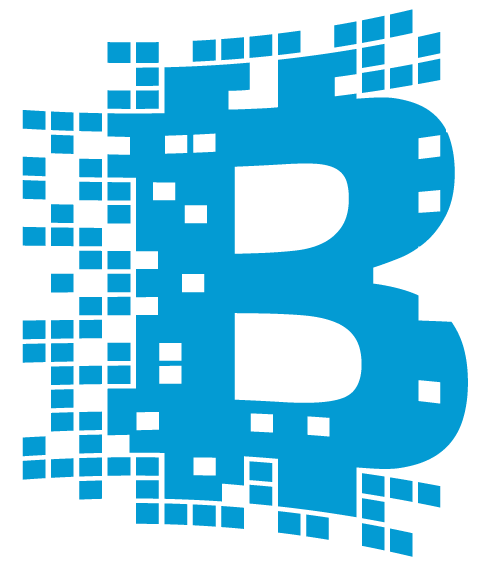
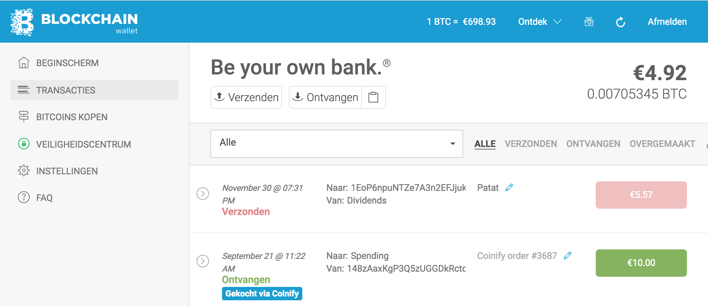
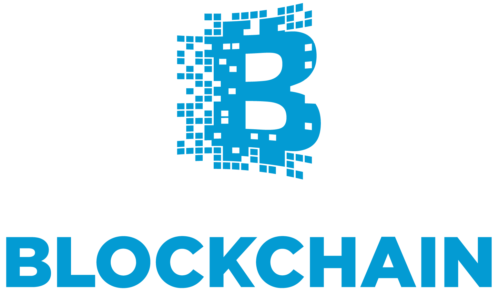

footer: 2016-12-07 - Dutch Blockchain Hackathon - Technology Deep Dive - sjors@blockchain.com
slidenumbers: true
autoscale: false



* [Blockchain.info](https://blockchain.info/)
 * Bitcoin blockchain[^1] info
 * Popular Bitcoin wallet
 * Offices in London & NYC

* Sjors Provoost
 * Web Wallet Developer
 * Commutes between Utrecht and London

[^1]: The Bitcoin blockchain still has the most hash power behind it.

^ info: website + API

---

## Wallet in Browser



^ AngularJS UI

^ Pure Javascript core

---

## Wallet in NodeJS


^ Familiar with NodeJS?

<!--
convert wallet.png -blur 20x20 -alpha on -channel a -evaluate set 75% wallet-blur.png
-->

### Install

```sh
npm install blockchain/my-wallet-v3#v3.24.5
```

^ NPM = Node Package Manager

### Load

^ In a file, or in a console (REPL)

```js
Blockchain = require('blockchain-wallet-client')
```

<!--
A small hack is needed, if I don't get around to publishing a new version.

npm install xmlhttprequest

XMLHttpRequest = require("xmlhttprequest").XMLHttpRequest
navigator = {userAgent: ""}
Blockchain.API.API_ROOT_URL = "https://api.blockchain.info/"
-->

^ Experimental

---

## Create a wallet

```js
email = 'sjors+delft@blockchain.com'
pwd = 'very_weak'

Blockchain.MyWallet.createNewWallet(
  email,
  pwd,
  '',
  'EUR',
  'en',
  console.log,  // Success
  console.error // Error
)
// 1822bb00-5c33-46a9-bbcb-b75de17fca66
```

^ Returns user identifier

---

## Login

```js
user_id = '1822bb00-5c33-46a9-bbcb-b75de17fca66'
pwd = 'very_weak'
Blockchain.MyWallet.login(
  user_id,
  pwd,
  { twoFactor: null, sessionToken: null }, {}
).then(MyWallet.wallet.fetchAccountInfo)
```

---

## Get funding address

```js
account = MyWallet.wallet.hdwallet.accounts[0]
account.receiveAddress
// '1ALfF8Ps8bkZT1qyf2TVa1Lu3P74wUfog2'
```

## Show account balance

^ I funded this wallet manually

```js
// Loads balance and recent transactions
MyWallet.wallet.getHistory()
account.balance
// 113702 (in Satoshi = €0,70)
```


---

## About wallets

^ JSON file, stored on our server

^ Encrypted, with password

^ Most important: seed hex (from which all wallet private keys and addresses are derived)

^ BIP 39: seed -> set of words, as backup

```js
{
  "user_id": "1822bb00-5c33-46a9-bbcb-b75de17fca66",
  "options": {
    "pbkdf2_iterations": 5000 // Password is hashed using PBKDF2
  },
  "seed_hex": "65b4cd78ba92d490466532a7939e5405",
  //           grant please funny inside coil else book play pole ostrich never arctic
  "address_labels": [{
    "index": 1, "label": "Zakgeld"
}
```

* encrypted in browser, stored on server
* we can't access your private keys, nor reset your password

---

## Spend coins

```js
p = new Blockchain.Payment()
p
  .to('1AvPkgjx2RKFW6xeqKVoKjsmJMZWrqs17w')
  .from(0)
  .amount(50000) // In Satoshi = €0.35
  .build()
  .sign()
  .publish()
```

^ From default (first) account

---

## Import private key

^ E.g. from paper wallet

```js
wallet = Blockchain.MyWallet.wallet
pk = 'L3qqTb8FD1wWhfZjjyJSiwQZyp3oLbycBNB9So45bj4uAYrP5YmS'
wallet.importLegacyAddress(pk, '')
addr = wallet.keys[0].address;
// 1AvPkgjx2RKFW6xeqKVoKjsmJMZWrqs17w
```

## Show balance:
```js
addr.getBalance()
// 50000 // In Satoshi = €0.35
```

---

## Monitor address

^ Waiting for a payment

^ Construct command, send

^ Don't call us, we call you

```js
op = MyWallet.ws.msgAddrSub(account.receiveAddress)
// '{"op":"addr_sub","addr":"1ALfF8Ps8bkZT1qyf2TVa1Lu3P74wUfog2"}'
MyWallet.ws.send(op)
```

## WebSockets

* "a computer communications protocol, providing full-duplex communication channels over a single TCP connection." - [Wikipedia](https://en.wikipedia.org/wiki/WebSocket)

---

```js
{
	"op": "utx",
	"x": {
    "hash": "f22525fd3fdbac441267b4f68f13fb8f1cabd6d0967a48844647b91e3f9ef8ea",
		"inputs": [{
			"prev_out": {
			    "spent": true,
				"addr": "1Ea4SXJbd2z7NszrS23i5rAd4v7LjuuJCE", // Sender wallet
				"value": 3040127, // 0.003 BTC
			},
		}],
		"out": [{
			"spent": false,
			"addr": "1ALfF8Ps8bkZT1qyf2TVa1Lu3P74wUfog2", // Our wallet
		}, {
		   ... // Change
		}]
```

---

## Process websocket message

<!-- TODO: write helper method to make this more pretty -->

```js
MyWallet.getSocketOnMessage = (msg) => {
  obj = JSON.parse(msg)
  if (obj.op === 'utx') {
    if (obj.x.out.filter(
      (output) => output.addr === account.receiveAddress
    ).length) {
      console.log('Coins received!')
    }
  }    
}
```

<!--
MyWallet.getSocketOnMessage('{ "op":"utx", "x":{ "lock_time":0, "ver":1, "size":226, "inputs":[ { "sequence":4294967295, "prev_out":{ "spent":true, "tx_index":194127120, "type":0, "addr":"1Ea4SXJbd2z7NszrS23i5rAd4v7LjuuJCE", "value":3040127, "n":1, "script":"76a91494da3bc8b2270627aa9fe13b80c748c39bc3c74488ac" }, "script":"483045022100f78ef5b3cc18fd7ae6d3eaa0d4155751a939e59a534f8dc940874e98685598dc02206f894b55e5aac56ac00365c9d5d4b81f42b6680466d9b016807d166fd4d2df770121028a90e8fbbebb54650644d49f41df87c17bf4151a481dd17ef053a64e53da9c63" } ], "time":1480512409, "tx_index":194128368, "vin_sz":1, "hash":"f22525fd3fdbac441267b4f68f13fb8f1cabd6d0967a48844647b91e3f9ef8ea", "vout_sz":2, "relayed_by":"127.0.0.1", "out":[ { "spent":false, "tx_index":194128368, "type":0, "addr":"1ALfF8Ps8bkZT1qyf2TVa1Lu3P74wUfog2", "value":3339, "n":0, "script":"76a9146670f59f1585bf019e9cb24febafa5a65a4699a288ac" }, { "spent":false, "tx_index":194128368, "type":0, "addr":"13HcUqTicSU2cVrWhae1JqWao7AYriJWfB", "value":3022098, "n":1, "script":"76a9141914862bb3475a5c98f2a15f975469a99ef61a8488ac" } ] } }')
-->

---

## Buy Bitcoin with NodeJS

* Partner company handles the purchase

<!-- Verify your email and whitelist your IP address in advanced settings before calling this  -->

<!-- TODO: MyWallet.wallet.external.addCoinify() should return coinify -->

<!-- You also need to set the partner ID:
coinify.partnerId = 19
-->

```js
coinify = MyWallet.wallet.external.addCoinify()
coinify.signup('NL','EUR').then(console.log)
// user: ....,
// offlineToken: 'AkwyQ...'
```

* Partner account details stored in wallet

<!-- Actually they're stored in the new metadata service, which uses a deterministic URL and encryption key, based on your BIP 39 seed. But that's a whole different presentation -->

* Bitcoin goes straight to your wallet

^ Wallet communicates with partner API

^ JSON web token: proof that we verified your email

---

* Ask quote and buy:


```js
coinify.getBuyQuote(10 * 100, 'EUR', 'BTC').then((quote) => {
  console.log(quote.quoteAmount / 100000000, "BTC")
  quote.buy('card').then((trade) =>
    console.log(trade.address)
    // Do some manual stuff with your creditcard
  )
})
```

* Monitor purchase address (web socket):

<!-- to simulate a purchase, call:
coinify.trades[0]._state = 'completed'
Then send some BTC to the address.
-->

```js
coinify.monitorPayments()
coinify.trades[0].watchAddress().then(() => console.log('Bitcoin Received!'))
```

---

## Sign a message

* Prove that you have the private key for an address:

```js
addr = MyWallet.wallet.keys[0].address;
// 1AvPkgjx2RKFW6xeqKVoKjsmJMZWrqs17w
msg = 'Hallo Delft'
sig = MyWallet.wallet.keys[0].signMessage(msg)
// 'H2yfcyYDoSj+siL4rvMmnHIvKUDH4GThFHYGlQk28q79AhreibtQvmaH+5W6hRty+S1gQeFXbaKs04xjIsHRCOE='
```

* Verify the proof:

```js
Blockchain.Helpers.verifyMessage('1AvPkgjx2RKFW6xeqKVoKjsmJMZWrqs17w', sig, msg )
// true
```
---

## Thank You



# Resources

* https://github.com/blockchain/my-wallet-v3
* https://www.blockchain.com/careers/
