footer: 2017-11-01 - Bitcoin Devs HK - sjors@sprovoost.nl - @Provoost on Twitter
slidenumbers: true
autoscale: false

# Replay Protection

* Investor TL&DR[^1]
* Replay problems
* Replay protection schemes
 * Ethereum Classic: before and after
 * Bitcoin Cash
 * SegWit2x

[^1]: Things will get quite technical. Feel free to run away after first non-technical slides :-)

---

# Airdrops vs. Forks

* Airdrop
  * "free" coins based on BTC balance[^10] at date X
  * safe to ignore, risky to use
* Contentious Hard Fork
  * disagreement on what Bitcoin is
  * not safe to ignore, unless you HODL

[^10]: Assumes you already posses your private keys, as you should.

---

# Airdrop
## Free money!? (BCash, BGold, etc)

^ Better safe than sorry. Sooner or later on of these airdrops coins will contain malware. Even without malware, simple incompetence of developers can lead to loss of your bitcoin. Most Bitcoin developers have better things to do than inspect this code. They will write gloating articles explaining what went wrong _after_ you lost your Bitcoin.

^ Wait for well established wallets to support; but they can make mistakes too. Remember Cryptsy.

  * 1 BTC on Aug 1 -> 1 BCH
  * same private key controls both
    * distrust "official" wallets; assume malware
    * move BTC to fresh wallet first (just in case)
  * privacy (traces on two blockchains)  
  * safe to ignore (due to replay protection)

---

# Contentious Hard fork
## SegWit2x may get messy

  * 1 BTC on Nov ~15 -> 1 BT1 + 1 BT2
  * some companies claim BT1 is Bitcoin
  * other companies claim BT2 is Bitcoin
  * several companies will go back and forth
  * no or little replay protection
  * never assume companies know what they're doing

---

# Remember The DAO?

  * Code is Law!
  * $60M ETH stolen from smart contract
  * Most developers, holders and miners agreed on need to fork
    * Soft-fork wasn't possible (halting problem)
    * Deadline (not self imposed)

---

# Ethereum Hardfork

* Just click YES

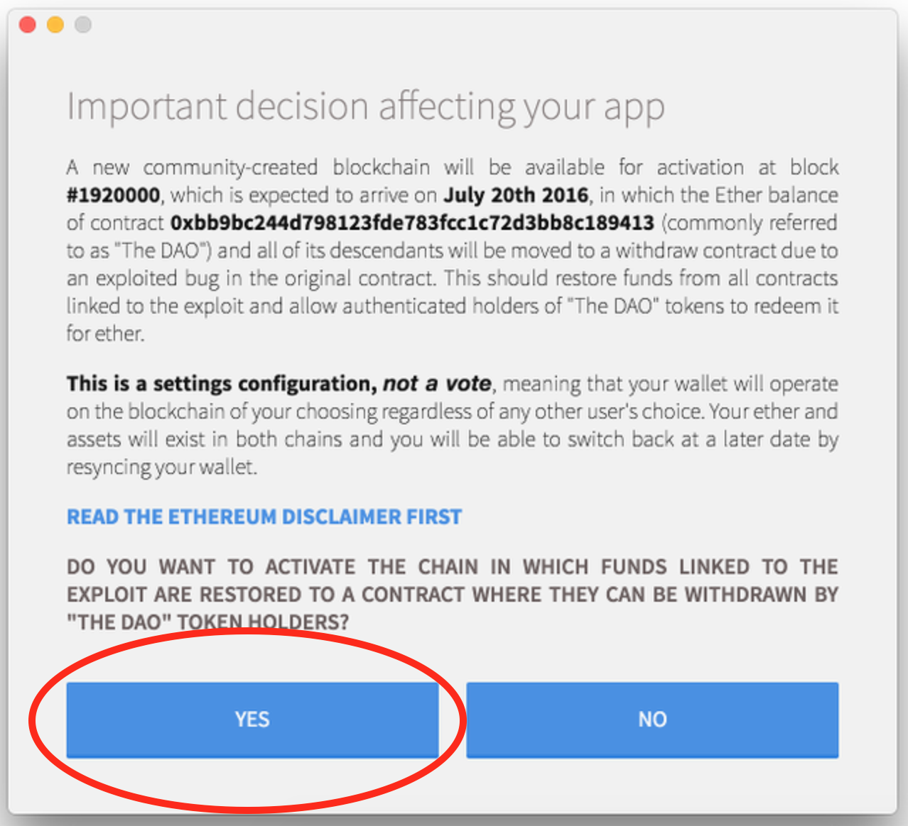

---

# Ethereum Classic

* Just click NO

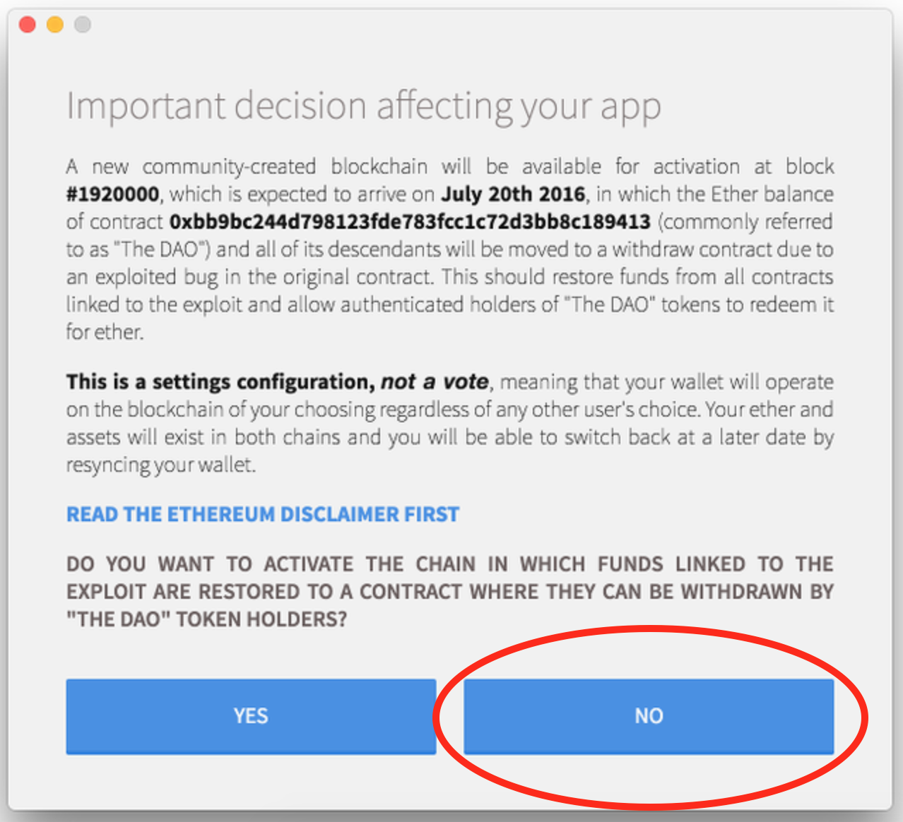

---

# The First Replay Attacks

* Coinbase ETH withdrawals also sent ETC[^31]

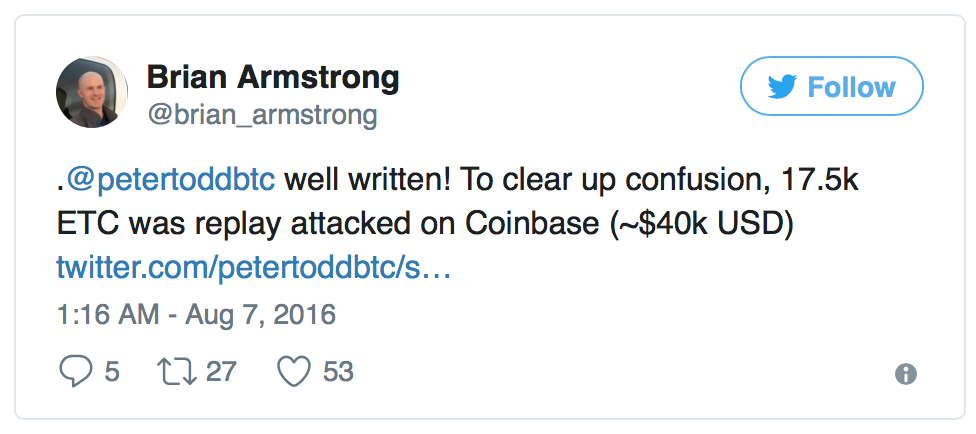

[^31]: They had several weeks to prepare. Don't assume companies in this space know what they're doing in all circumstances.

---

# Manual - Split contract

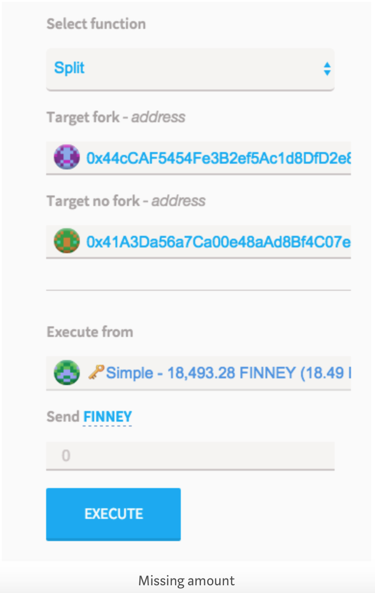

^ Desktop wallet only follows one chain, but you could label an address as "ETC-only"

---

# Manual - Split contract

^ Also: transaction nonce.

```javascript
contract AmIOnTheFork {
    bool public forked = false;
    address constant darkDAO = 0x304a554a310c7e546dfe434669c62820b7d83490;
    function update() {
        if (block.number >= 1920000 && block.number <= 1921200) {
            forked = darkDAO.balance < 3600000 ether;
        }
    }
    function() {
        throw;
    }
}
```

^ Source: https://medium.com/@chevdor/safer-version-of-the-replaysafesplit-smart-contract-a29c347e8a7

^ Many other versions

---

# Manual - Split contract

 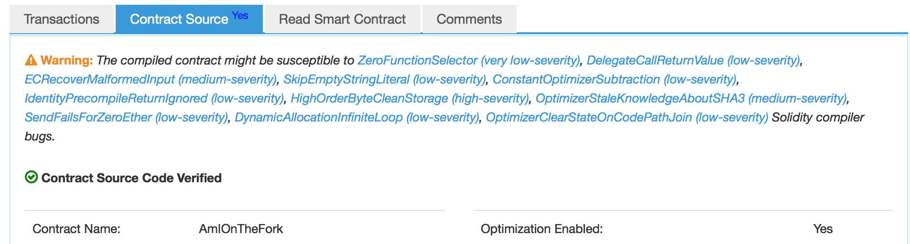

---

# Manual - 6 easy steps

* Ingredients
  * ETH wallet + ETC wallet
  * 1 teaspoon pure ETH
  * two block explorers
* Procedure
  1. send ETH balance (inc teaspoon)
  2. send ETC balance

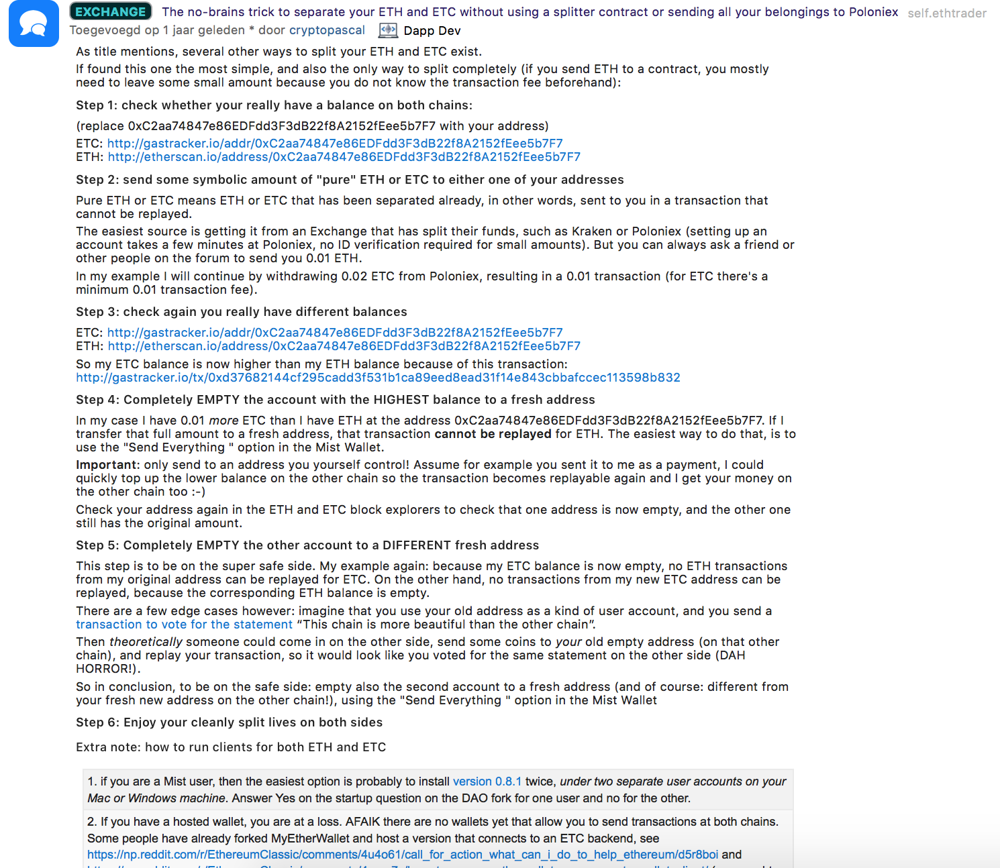

^ This can still go wrong if an attacker sends you a teaspoon on the other chain quickly enough

---

# Automatic - EIP 155

^ Several months later...

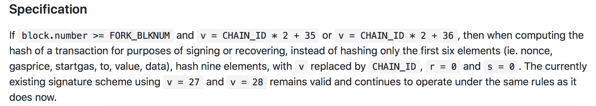

* another hard fork (Spurious Dragon, Nov 2016)
* opt-in, but wallets use by default
* same address format

^ Each hard fork needs to decide if they want to add replay protection, so this requires guessing if it's going to be contentious.

<!-- 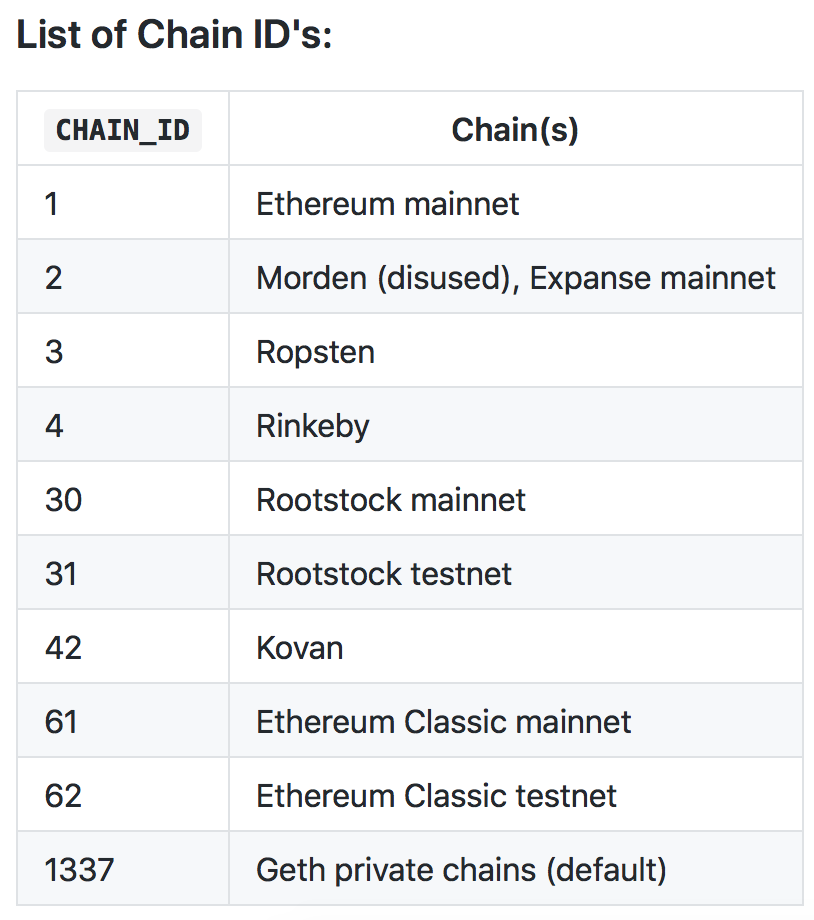 -->


---

# Bitcoin Cash

* initially opt-in
* last minute change to mandatory
* same address format
* SIGHASH_FORKID and BIP43

---

# Bitcoin Cash
## BIP143: new signature algorithm
* covers value of the input being spent
* solves quadratic hashing
* must be combined with SegWit
* BCH uses BIP143 without SegWit[^40]
 * BCH tx invalid on BTC chain

[^40]: this gives them some of the benefits of SegWit

^ "The BIP143 signature generating algorithm covers the value of the input being spent, which simplifies the design of air-gapped light-weight wallets and hardware wallets." - https://bitcoincore.org/en/segwit_wallet_dev/

---

# Bitcoin Cash
## SIGHASH_FORKID

* mandatory for BCH
* valid but non-standard for BTC
* makes BTC transactions invalid on BCH chain
* combined with BIP143: protection both ways
* illustration in next slide

---

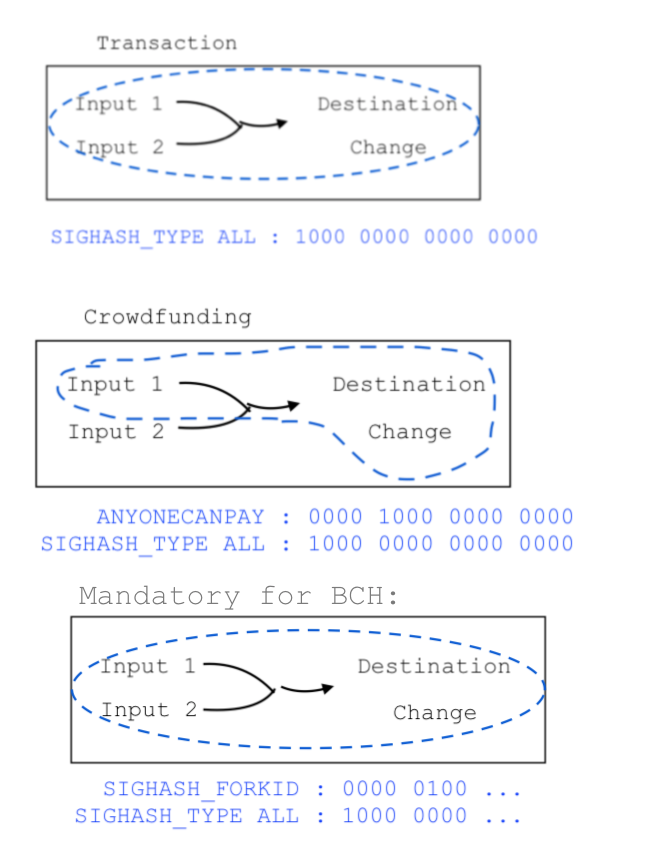

^ the 0x01 at the end of a normal transaction is SIGHASH_ALL.

^ https://github.com/bitcoinbook/bitcoinbook/blob/second_edition_print_1/ch06.asciidoc#signature-hash-types-sighash

^ https://github.com/Bitcoin-ABC/bitcoin-abc/blob/master/src/script/interpreter.h#L26

^ https://github.com/Bitcoin-UAHF/spec/blob/master/replay-protected-sighash.md#sighash-type (is this more recent?)


^ (?) SigHash field is 4B when you sign it, but it gets truncated to the last byte when you serialise the signature.

---

# Bitcoin Cash - Ledger device

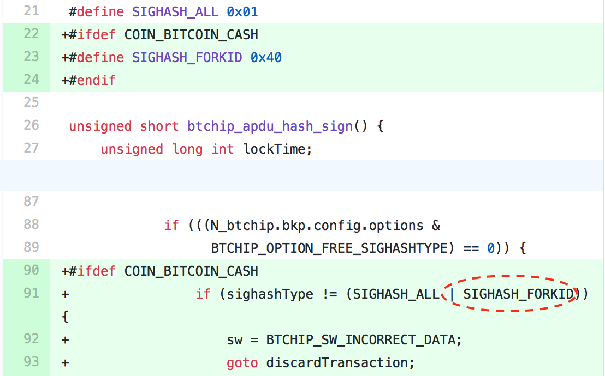

^ Screw specs, just read wallet source code.

^ The changes needed on the device to support it were pretty simple:  https://github.com/LedgerHQ/blue-app-btc/commit/6fcd9d27f078e0a035019562adc4a875d9aa27e6, i.e. don't sign a transaction if SIGHASH_FORKID isn't set.

^ Chrome plugin magic happens here: https://github.com/LedgerHQ/ledger-wallet-chrome/blob/1.9.6/app/libs/btchip/btchip-js-api/BTChip.js#L1674-L1675

---

# Bitcoin Cash

|       | Good miner | Naughty miner | Stupid miner |
| ----- | ---------- | --------| ------ |------ |
| **BCH tx**|
| BTC chain | -          | - | invalid: BIP143 w/o SegWit |
| BCH chain | standard[^42]   | - | -        |
| **BTC tx** |  |  |
| BTC chain   | standard    | - |  -       |
| BCH chain   | -           | - |  invalid: FORKID |

[^42]: IsStandard is a subset of all valid transactions. Non-standard transactions are not relayed or mined by default, but, a "naughty miner" could just mine it, making replay protection ineffective.

---

# Bitcoin Gold

* TBD
* Addresses will start with G (A for SegWit)

^ https://github.com/BTCGPU/BTCGPU/issues/17#issuecomment-339801030

---

# SegWit2x Constraints[^44]

1. minimal changes to software of participants[^45]
2. capture light weight wallets[^46]
3. nice to have; mostly a gesture to Core
4. limited development and review resources[^45]
5. (?) avoid hard-fork with BU

[^44]: self imposed

[^45]: most participants are adding non-protocol level replay protection

[^46]: light weight clients can just [inspect block 494784](https://twitter.com/LukeDashjr/status/919053114912727040)

---

# SegWit2x Constraints

|       | Good miner | Naughty miner | Stupid miner |
| ----- | ---------- | --------| ------ |------ |
| **Unupgraded wallet**|
| 1x    | standard   | - | - |
| 2x    | standard   | - | - |
| **BT1-only legacy & SegWit** |  |  |
| 1x    | standard    | - |  -       |
| 2x    | -           | - |  invalid |
| BU    | -           | - |  non-standard |
| **BT2-only legacy & SegWit** |  |  |
| 1x    | -    | - |  invalid |
| 2x    | standard      | - | - |
| BU    | standard      | - | - |

---

# SegWit2x
## 1x-only using magic address

* 3Bit1xA4apyzgmFNT2k8Pvnd6zb6TnwcTi
* manual, no wallet change needed
* UTXO "spam"
* phishing "tutorials"
* BU support (using standardness)

^ Not all wallet support sending to multiple addresses
^ https://github.com/BitcoinUnlimited/BitcoinUnlimited/pull/790

---

# SegWit2x
## 1x-only using magic address

|       | Good miner | Naughty miner | Stupid miner |
| ----- | ---------- | --------      | ------    |
| **B1X tx** (to 3Bi...)|
| 1x chain   | standard   | -             |      -     |
| 2x chain    | -          | -             | invalid: address |
| **B2X tx** (not to 3Bi...)|  |  |
| 1x chain    | replay      | standard     |  -       |
| 2x chain    | standard    | -            |  -       |

^ https://github.com/btc1/bitcoin/commit/a3c41256984bf11d95a560ae89c0fcbadfbe73dc

---

# SegWit2x
## 1x-only using OP_RETURN

* `OP_RETURN RP=!>1x`
* no UTXO spam

^ https://github.com/btc1/bitcoin/pull/134

---

# SegWit2x
## 1x-only using OP_RETURN

|       | Good miner | Naughty miner | Stupid miner |
| ----- | ---------- | --------      | ------    |
| **BT1** (OPRETURN RP=!>1x)|
| 1x chain   | standard   | -             |      -     |
| 2x chain    | -          | -             | invalid: OP_RETURN |
| **BT2** (no OP_RETURN)|  |  |
| 1x chain    | replay      | standard     |  -       |
| 2x chain    | standard    | -            |  -       |

---

# SegWit2x
## 2x-only - SIGHASH magic


* New: `SIGHASH_2X_REPLAY_PROTECT` (4)
* Sets bit 8 in pre-image (BCH used bit 6)
* Bit 8 isn't appended to signature
  * Core node consider signature invalid
* hard-fork relative to BU

---

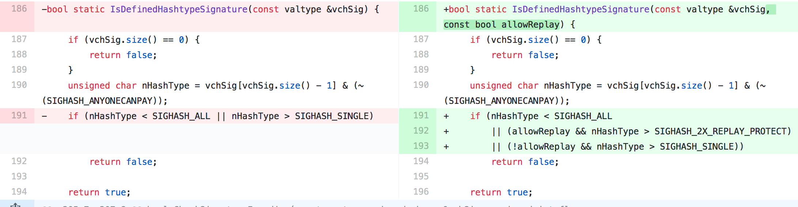

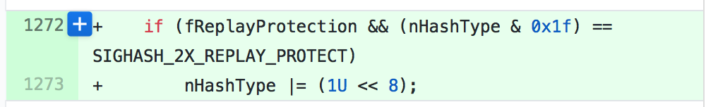

---

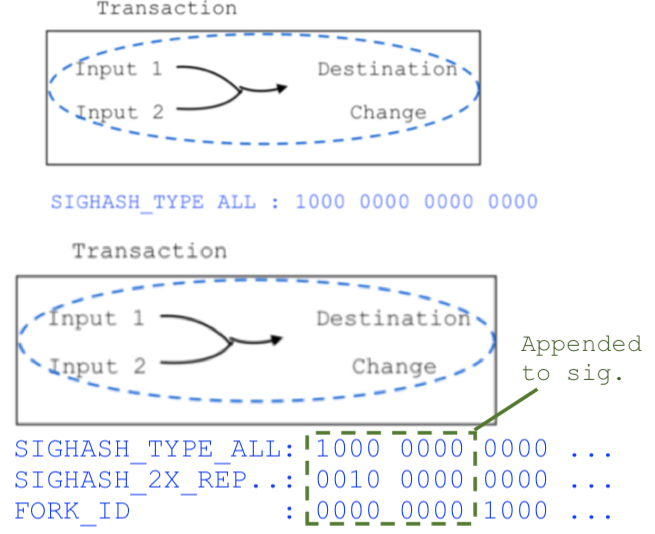

^ https://github.com/btc1/bitcoin/pull/131

^ Set bit 8 if SIGHASH_2X_REPLAY_PROTECT is set and we're past the fork block

^ https://bitcoin.stackexchange.com/questions/48108/why-are-sighash-flags-signed-as-4-bytes-when-only-1-byte-is-included-in-the-tran

^ https://bitcoin.stackexchange.com/questions/61706/where-is-sighash-type-serialized-in-segwit

---

# SegWit2x
## 2x-only: SIGHASH magic

|       | Good miner | Naughty miner | Stupid miner |
| ----- | ---------- | --------| ------ |------ |
| **BT1 tx** (no magic)|
| 1x chain   | standard   | - |  |
| 2x chain    | replay     | standard | -        |
| **BT2 tx**  (SIGHASH magic)|  |  |
| 1x chain    | -  | - |  invalid signature  |
| 2x chain    | standard           | - |  - |

^ This is quite different from the BCH approach.

---

# Spoonnet Replay protection
Somewhat similar to the above.

* uses nVersion [^50]
* hardfork network version bit is 0x02000000
* 0x02000000 is added to the nHashType
* leaves serialized `SIGHASH_TYPE` alone

[^50]: "A tx is invalid if the highest nVersion byte is not zero, and the network version bit is not set" ([bitcoin-dev list](https://lists.linuxfoundation.org/pipermail/bitcoin-dev/2017-February/013542.html))

---

# SegWit2x - Unprotected?

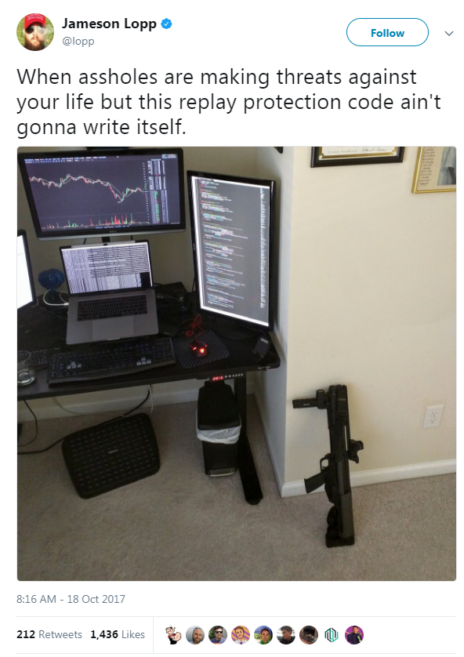

* HODL!
* UTXO mixing
* nLockTime
* >1 MB transaction
* Or just use a custodial service :-(
  * Exchanges
  * Split services

^ Easiest thing to do during fork is to not use Bitcoin for a while, but not everyone has that luxery.

^ Custodial wallets and exchanges can take care of the splitting. They can split customer funds in batches, saving money.

^ Maybe a 1 MB transaction can be done via a trustless mixer? But how to guarantee it's bigger than 1 MB?

^ Some other options here: https://github.com/btc1/bitcoin/issues/34#issuecomment-339573341

---

# UTXO Fairy Dust

* Ask miner: coinbase tx unique for each side[^70]
* Service can split using other method
* (paid) API with anyone-can-spend UTXO's?
* Wallet coin selection must include these inputs[^71]

[^70]: natural, organic replay protection, but can't be done until 100 blocks after the fork

[^71]: proof-of-replay-protection?

---

# nLockTime - 4 easy steps

nLockTime: not mined or relayed[^80] before block N

1. generate two addresses (A1, A2)
2. check which chain moves faster (e.g. H2 > H1)
3. sign tx[^81] to A2 with H1 < nLockTime < H2
4. send to A1 w/o nLockTime[^82]

[^80]: IsStandard() rules

[^81]: Bonus: use RBF (unpredictable fee market)

[^82]: wait until confirmed, try again if needed

^ https://en.bitcoin.it/wiki/Timelock

^ H1: block height of 1x chain, H2: block height of 2x chain

---

# nLockTime - problems

* wallet must monitor both chains
* need to wait for gap in block height
* sweep is bad for privacy
* must wait for step 4, risks:
  * reorg (e.g. intentional wipeouts)
  * fees in BTC terms > balance
* receiving new unsplit funds

^ Only works while one side of fork has a big enough lead. Can't be used immediately after fork

^ This is hard to do manually, but also hard to automate for non-custodial wallets. User needs to come back several times, lots of edge cases to handle in UI.

^ When receiving new funds, wallet must reason if those funds are already replay protected, or its coin selection must always include coins that are known to be protected.

^ We'll learn all sorts of new problems as people start losing their money.

---

# > 1MB

* valid on 2x, invalid on 1x
* non-standard (coordinate with miners)
* expensive (easier for a service)
* maybe using CoinJoin?

---

# Other Fork problems

* Address reuse
* Privacy
* Unconfirmed transactions
* Price feeds
* Bad decisions by judges
* ...

^ Replay protection is not the only problem...

---

# Thanks
Dump your 1x / 2x coins here:

- Slides: [slideshare.net/provoost](https://slideshare.net/provoost)
- Blog: [medium.com/provoost-on-crypto](https://medium.com/provoost-on-crypto)
- PGP ED9B DF7A D6A5 5E23 2E84  5242 57FF 9BDB CC30 1009

^ -----BEGIN PGP SIGNED MESSAGE-----
Hash: SHA512

3G8ad4bq7omdk7YT8fPQfWHtHcBrZUDRBL
-----BEGIN PGP SIGNATURE-----

iQIzBAEBCgAdFiEE7ZvfetalXiMuhFJCV/+b28wwEAkFAln5nisACgkQV/+b28ww
EAmXuhAApRDhD83De+hZbTgECidiIfCHGlEbGqTeGf37s4FaSIk1FoycoIUy6VAi
MwZi360BWw8Q27qQpidalFDjHK9dbdDVoqWxHKuY5XyvNFP685VKar0BqvoXB3ny
aH3V0g+LHRp5bsYzhthUcz3sBteFh64fh7XbLVntmc+rZCQOx+DXAg+y1g+Z9rwd
Ve62xHaSLmOUzrfUeNuP0JbpauRio+GJs7hUeYjB/oYRpUNLacJ4/4ucNILez7+p
EvUsUHpXqS012bp3jma/qPgoW328vSpsgmhFYL7lHN3+cJRFq6gvt/zGG7j2nViO
3FyObXUquPJlDNlI0iDN0rFCZtpi5GN7vJkclhQKW9mqQA+gQ9ROz2rkM7sFHm2b
czQKrNfT/3t2oR02Sm+MZhj4h5vWL6P/gEjoI/udQWD8Nxfj+qFWbM1VIVKExaZk
gDAh+tZ2i/Q5a2Xc2UTsMB64kJ2/YXsayIORc4TIP+poj21IgcE4wmoRsbxqnDnv
oCmAfh/enS7txtC9s/AknBwEdmTF+j59mAGoe/SKzLnnvS6sR7Iq5nn4QioS5eLm
DAdZguUm+ZxqS0iO0w3TUSftMgVidF2f0kT9rw79bLxMbBKU2HaWBQVU1/rY+s0j
91eCam9GJZGfcykkmEsCrREzMEsxOENtoj8LyPbryRs5ZGe6ZwE=
=DKGR
-----END PGP SIGNATURE-----
