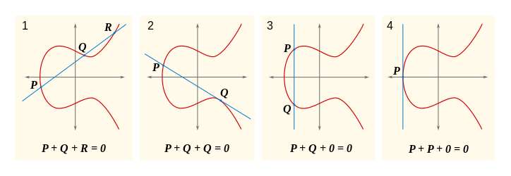
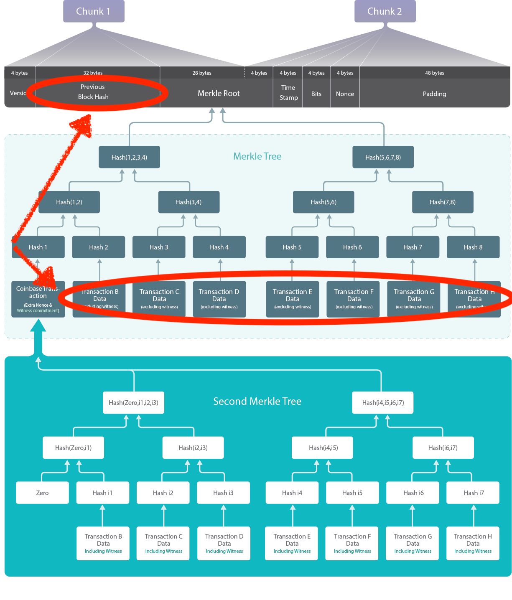
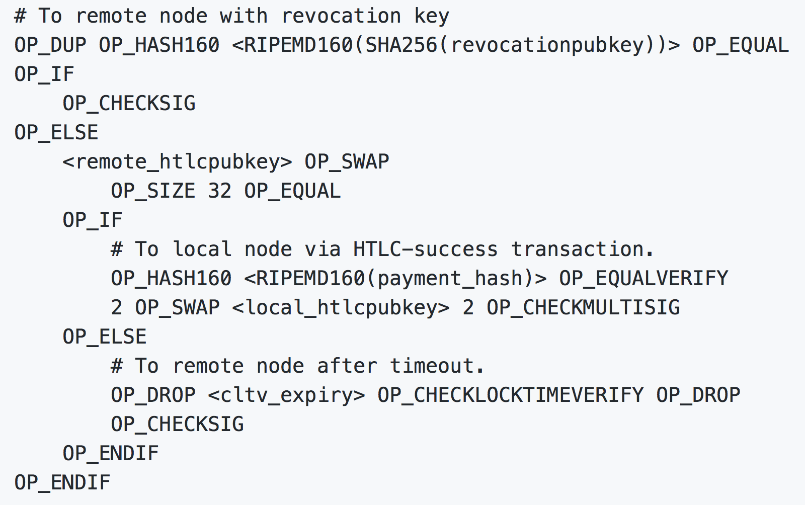

footer: 2018-03-24 - Code Block London - sjors@sprovoost.nl - @provoost on Twitter 
slidenumbers: true
autoscale: false

# Bitcoin's Moving Parts

* Coins
* Digital signatures
* Chain of blocks
* Proof of work
* Censorship resistance
* Anatomy of a Transaction

---

# The Problem

Alice emails Bob: "I give you 2 BTC"

1. Why is it worth anything?
2. What did Bob get that Alice gave up?

^ 1. Because people are willing to exchange it for money and other things of value.
^ 2. A coin

[.build-lists: true]

---

# Coins

* Alice has two 1.5 BTC coins[^1]
* Alice emails Bob:

  > I spend my coins, and create:
  > - 2 BTC coin for Bob; and
  > - 1 BTC coin for Alice

[^1]: UTXO: Unspent Transaction (tx) Output

---

# The Problem

Alice emails Bob: "I give you 2 BTC"

1. Why is it worth anything?
2. What did Bob get that Alice gave up?
3. How does Alice prove she owned the coin?

---

# Digital signatures

* Private key: big random number
* Public key: point on curve[^2]

* private key can encrypt or sign message

[^2]: secp256k1

^ In Bitcoin the message is public, so only signed, not encrypted

^ Exchanging public keys can be a hassle, e.g. SSL certificate chains or GPG key signing parties...

---

# Digital signatures

* Coin is signed message: "Only Alice can spend me" [^3]
* Who's Alice?
* Bitcoin address derived from public key [^4]
* Alice is whoever can reveal public key and sign a message with private key

[^3]: The new coins say "Only Bob can spend me" and the change says "Only Alice can spend me".

[^4]: Q&A tip: why not just use the public key as a Bitcoin address?

---

# The Problem

Alice emails Bob: "I give you 2 BTC"

1. Why is it worth anything?
2. What did Bob get that Alice gave up?
3. How does Alice prove she owned the coin?
4. _What if Alice sends Carol the same coins?_

^: 4. Instead of email, let's use a blockchain

---

# [fit] The Blockchain

---

> A Blockchain is a chain of blocks
-- Peter Todd

---

> A Blockchain is a database with virtue
-- Chris DeRose

---

# The Blockchain

Things we care about to solve problem (4):

* Publish all transactions, and in which order
* Ensure everyone can see all transactions

^ Merkle trees: each block tied to its transactions, and the previous block

^ Image Source: https://blog.bitmex.com/graphical-illustration-of-a-bitcoin-block/

---

# The Problem

Alice publishes: "I give Bob my 2 BTC"

1. Why is it worth anything?
2. What did Bob get that Alice gave up?
3. How does Alice prove she owned the coin?
4. What if Alice sends Carol the same coins?
  * _it's on the blockchain so everyone can see it_
  * what if there's many different blockchains?

---

# The Problem

Alice publishes: "I give Bob my 2 BTC"

1. Why is it worth anything?
2. What did Bob get that Alice gave up?
3. How does Alice prove she owned the coin?
4. What if Alice sends Carol the same coins?
  * it's on the blockchain so everyone can see it
  * _what if there's many different blockchains?_

---

# Solution 1: use a regulator

* declare existence of conflicting blockchains fraud
* give regulator(s) access to your database
* add additional crypto magic
* brand it "blockchain inspired technology"

---

# Solution 2: Proof-of-Work

Convince someone to:

* do useless work
* which uniquely commits to transaction data
* in exchange for coins.

Throw dice on a piece of paper with the transaction list.

---

^ Imagine seeing the list of transactions in the video background

---

# Proof-of-Work

* `sha("000001 | Alice sends Bob 2 BTC, etc") = 0fed9a90`
* `sha("000002 | Alice sends Bob 2 BTC, etc") = e7c54529`
* `sha("000003 | Alice sends Bob 2 BTC, etc") = 6c48ab21`
* `sha("855453 | Alice sends Bob 2 BTC, etc") = 000005e6`
* N leading zeros -> X kWh * £0.10 -> £... per block [^5]
* Miner creates coin out of thin air which Alice & Bob consider valid

[^5]: Any scarce resource will do, but the simplest known combination with the right properties is electricity + specialized chips + hashing.

^ Difficulty adjusted so it's always ~10 mins

^ Uselessness is a feature. Specialized (ASIC) hardware can't be used for anything else, unlike CPU's which a government could have a large supply off that normally does other things. 

---

# The Problem

Alice publishes: "I give Bob my 2 BTC", miner burns electricity to attest this.

1. Why is it worth anything?
2. What did Bob get that Alice gave up?
3. How does Alice prove she owned the coin?
4. What if Alice sends Carol the same coins?
  * it's on the blockchain so everyone can see it
  * _what if there's many different blockchains?_

^ Many different blockchains require bribing miner.

---

# The Problem

Alice publishes: "I give Bob my 2 BTC", miner burns electricity to attest this.

1. Why is it worth anything?
2. What did Bob get that Alice gave up?
3. How does Alice prove she owned the coin?
4. What if Alice sends Carol the same coins?
5. _What if someone doesn't like Bob?_[^6]

[^6]: i.e. wants to stop the transaction

---

# Censorship resistance

* Miners compete, fees offer extra incentive
* P2P: transactions and blocks route around censorship
* Fungability: all transacions (should) look the same
* Lot's of problems left to solve

---

# Anatomy of a Bitcoin Transaction

> Alice publishes: "I give _Bob_ my 2 BTC"

* Bob is whoever can reveal _public key corresponding to Bob's address_ and sign a message with private key:

Alice publishes: 
OP\_DUP _OP\_HASH160 <Bob's address> OP\_EQUALVERIFY_ OP\_CHECKSIG

Bob spends: 
<Bob's signature>_<Bob's pubkey>_

^ Remember that Bitcoin address is derived from public key

---

# Anatomy of a Bitcoin Transaction

> Alice publishes: "I give _Bob_ my 2 BTC"

* Bob is whoever can reveal public key corresponding to Bob's address and _sign a message_ with private key:

Alice publishes: 
OP\_DUP OP\_HASH160 <Bob's address> OP\_EQUALVERIFY _OP\_CHECKSIG_

Bob spends: 
_<Bob's signature>_<Bob's pubkey>

---

# Script stack

* <Bob's signature>
* <Bob's pubkey>
* _OP\_DUP_
* OP_HASH160
* <Bob's address>
* OP_EQUALVERIFY
* OP_CHECKSIG

---

# Script stack

* <Bob's signature>
* <Bob's pubkey>
* <Bob's pubkey>
* _OP\_HASH160_
* <Bob's address>
* OP_EQUALVERIFY
* OP_CHECKSIG

---

# Script stack

* <Bob's signature>
* <Bob's pubkey>
* <Bob's address>
* <Bob's address>
* _OP\_EQUALVERIFY_
* OP_CHECKSIG

---

# Script stack

* <Bob's signature>
* <Bob's pubkey>
* _OP\_CHECKSIG_

---

# Script stack

* `true`

---

# Other opcodes

* `OP_CHECKMULTISIG` : N of M sigs
* `OP_CHECKLOCKTIMEVERIFY`: HODL
* `OP_IF` / `OP_ELSE`
* `OP_RETURN`: 80 bytes spam [^8]
* `OP_NOP`: does nothing (yet!)

[^8]: e.g. Rare Pepe trades: CryptoKitties, but with frogs

---

# Thanks
Slides: [slideshare.net/provoost](https://slideshare.net/provoost)

Blog: [medium.com/provoost-on-crypto](https://medium.com/provoost-on-crypto)

PGP: 
`ED9B DF7A D6A5 5E23 2E84  5242 57FF 9BDB CC30 1009`
