footer: 2018-09-19 - London Bitcoin Devs - sjors@sprovoost.nl - @provoost on Twitter 
slidenumbers: true
autoscale: false


# Bitcoin Core wallet

1. Graphic User Interface (bitcoin-qt)
2. Commandline Interface (bitcoin-cli)

---


---


---

# Bitcoin Core wallet

* validates all blocks
* well reviewed code
* sits on your computer

---

# Hardware Wallet


* not on your computer
* reveals addresses to 3rd party
* relies on external truth (e.g. SegWit2x)
* lots of code

---

# Combined

* keys not on your computer
* great privacy
* no external truth
* only hardware specific code to review

---

# Problems

* how to encode transaction data? PSBT
* how to communicate between device and Core wallet:
  * Electrum Personal Server
  * Semi manually
  * JSON-RPC standard?
* minimize amount of stuff to install
* not too radical changes to Bitcoin Core

---

# Anatomy of Bitcoin Core wallet

1. master private key
2. keypool of private keys
3. receive & change addresses

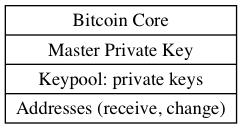

---

# Core + HWW Setup

* Start with empty watch-only wallet
* Import public keys from device


---

# Core + HWW Usage

* Fill keypool
* Generate receive address

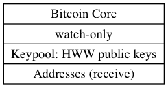

---

# Core + HWW Usage

* Generate unsigned transaction in Core
* Sign on device


---

# HWI

* Bitcoin Hardware Wallet Interaction scripts[^0] by Andrew Chow (instructions[^1])

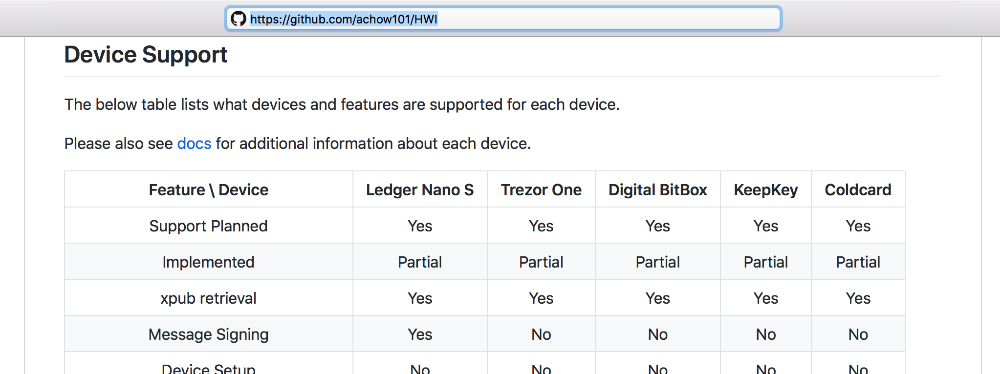

[^0]: https://github.com/achow101/HWI

[^1]: https://gist.github.com/achow101/a9cf757d45df56753fae9d65db4d6e1d

---

# List devices


* Fingerprint (of master xpub): needed for PSBT 

---

# Create watch-only wallet


Usefull stuff added in v0.17.0:

* dynamic wallet create / load / unload
* watch-only wallets

---

# Get keys from device: receive

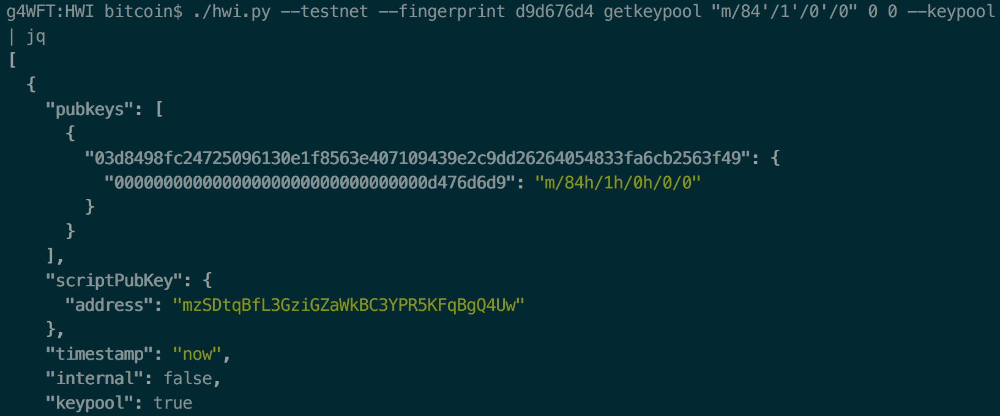

---

# Get keys from device: change

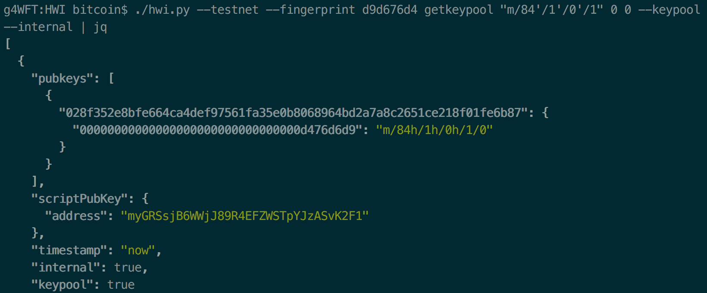

---

# Import keys into wallet

* Use achow101 branch[^2] (until it's merged)
* import lots of keys so you never have to repeat this 


[^2]: https://github.com/achow101/bitcoin/tree/hww

---

# Generate receive address

* no hardware device needed!

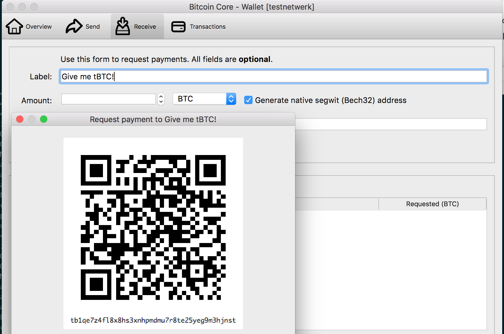

---

# Wait for confirmation

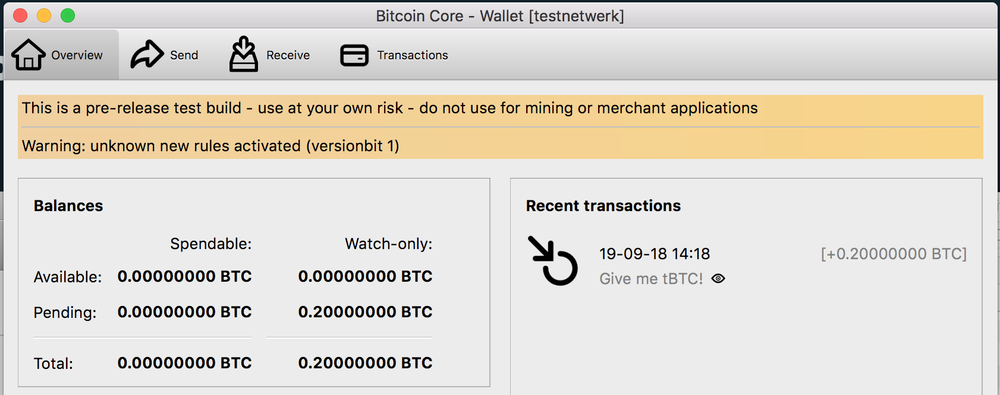

* there's a PR[^4] to make this prettier

[^4]: https://github.com/bitcoin/bitcoin/pull/13966

---

# Prepare transaction


* note: `{includeWatching: true}`
* note: `true` at the end adds HD paths

---

# PSBT

* Partially Signed Bitcoin Transaction
* Added to v0.17.0

---


---

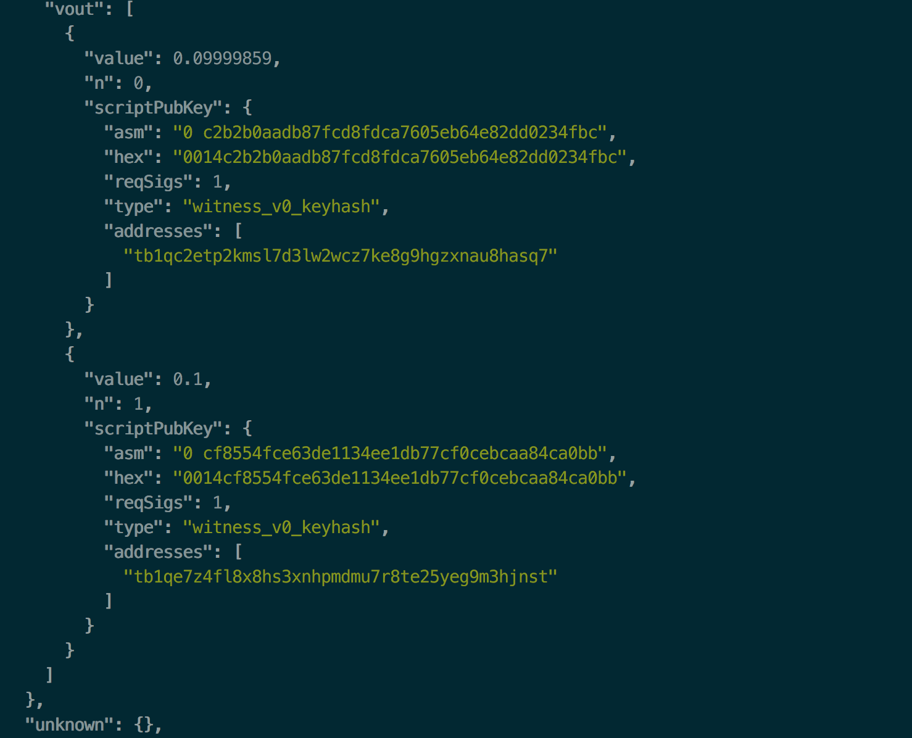

---


---

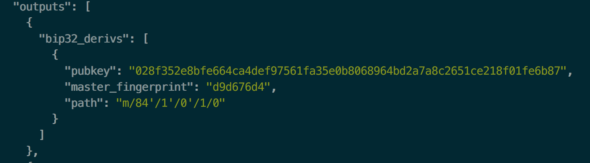

---

# Sign transaction

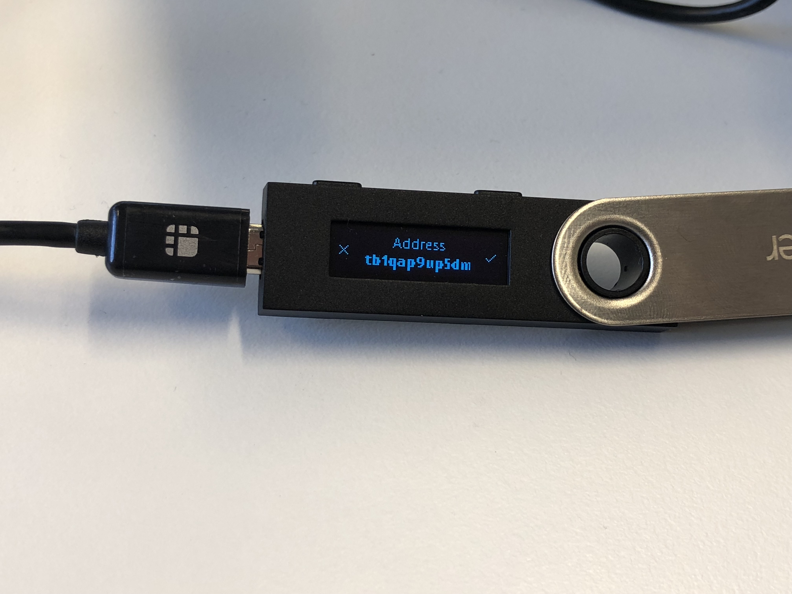


---

# Before


---

# After


---

# Finalize and broadcast

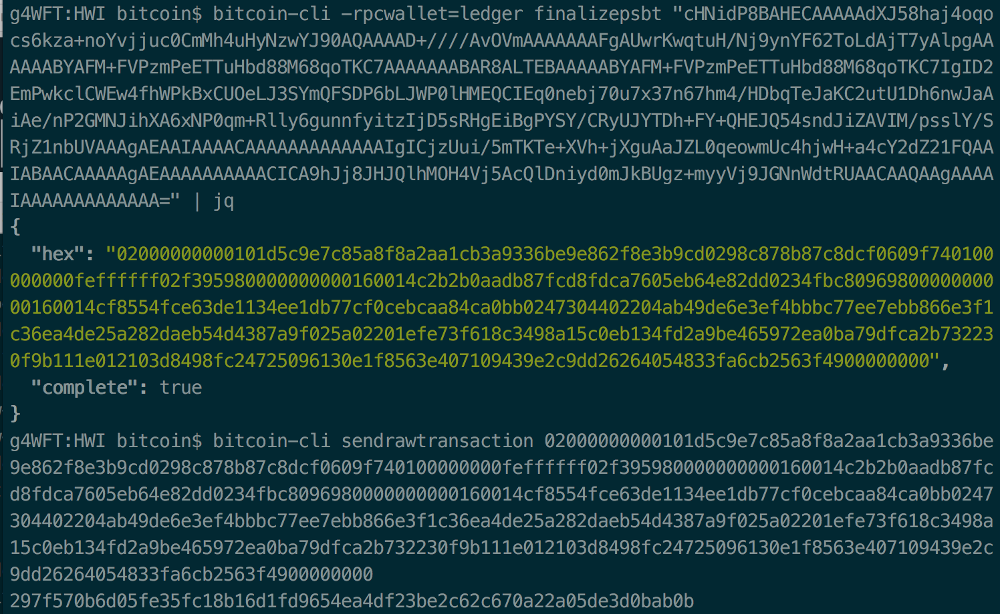

---

# Signer RPC

WIP, perhaps one day a BIP?

* hardware wallets can sign stuff
* multisig services like BitGo can sign stuff
* a JSON-RPC for wallets to communicate with signers?

---

Hardware wallet side:

```
enumerate
getxpub "device_id" "bip32_path"
displayaddress "device_id" "bip32_path" ("address_type")
signtx "psbt"
```

Bitcoin Core side:

```
bitcoind -signerrpc=localhost:1000

listsigners
displayaddress "device_id" "bip32_path" ("address_type")
importsignerkeypool "device_id" "bip32_path" start end
sendto "address" {signer: "device_id"}
```

---

# Thanks
Slides: [slideshare.net/provoost](https://slideshare.net/provoost)

Blog: [medium.com/provoost-on-crypto](https://medium.com/provoost-on-crypto)

PGP: 
`ED9B DF7A D6A5 5E23 2E84  5242 57FF 9BDB CC30 1009`
