footer: 2019-02-04 - Odyssey Tech Deep Dive - sjors@sprovoost.nl - @provoost on Twitter
slidenumbers: true
autoscale: false

# Unstoppable Money


<!--- Image source: https://www.technologyreview.com/the-download/609972/why-canada-looks-like-the-next-bitcoin-mining-haven/ -->

^ Tries to conserve network, disk space and RAM and only use it for mission critical stuff.

^ Adding anything non-financial can cause friction

^ Showing earlier attempts, then suggested approach (client side validation + pay to contract)

^ In particular: list of coins (UTXO set) is ideally kept in RAM, to quickly check new blocks, earlier schemes didn't account for this

---

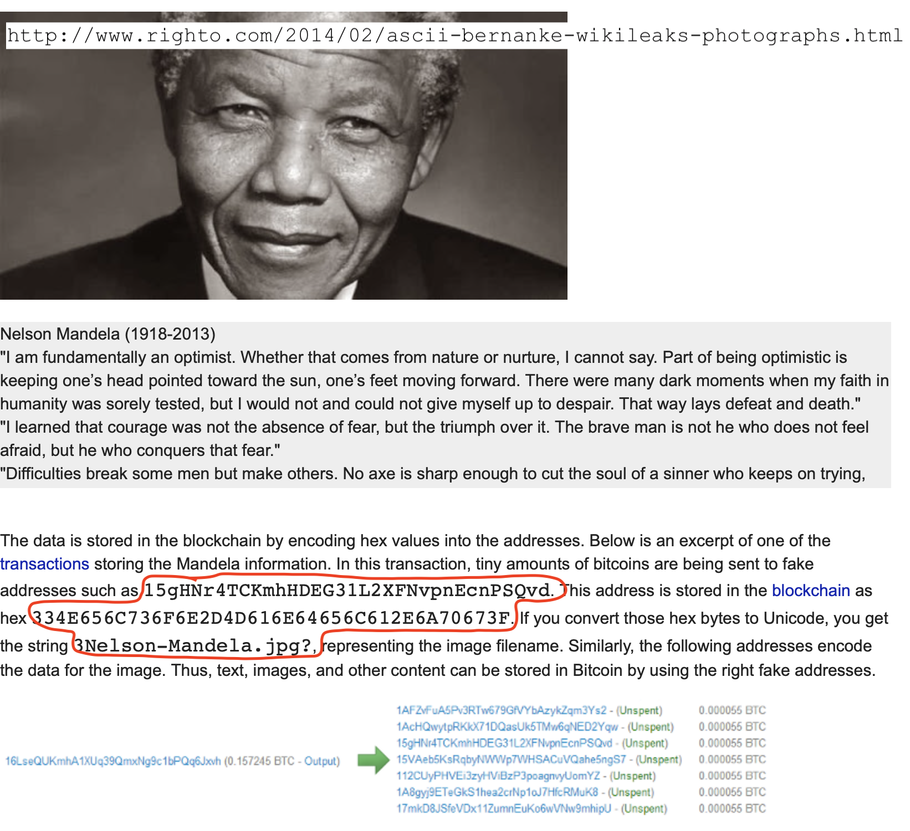

<!-- http://www.righto.com/2014/02/ascii-bernanke-wikileaks-photographs.html -->

^ €0.20 per 20 bytes -> €10 / kb, but that's paying 26 sat / byte. With low fees: ~€0.40 per kb.

^ Bitcoin doesn't know Mandela. Addresses look real, someone could spend them any moment. Probably not, but can't take the risk.

---

# Spammers gonna spam

^ introduced in 2013

^ permit: this method was not practical before, unless you knew a miner

^ provably prunable: download, process, discard

^ I'll save you the analogy Luke-Jr used

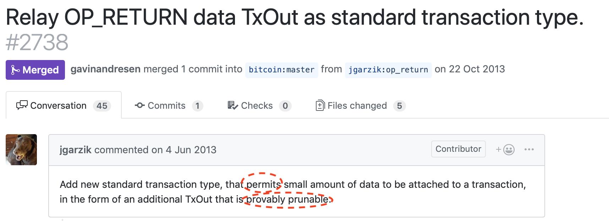


<!-- https://github.com/bitcoin/bitcoin/pull/2738
https://github.com/bitcoin/bitcoin/pull/3737 (reduce to 40)
https://github.com/bitcoin/bitcoin/pull/5286 (back to 80)
-->

---

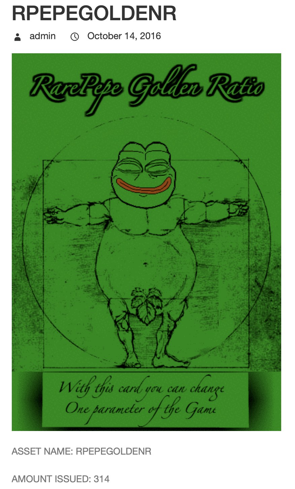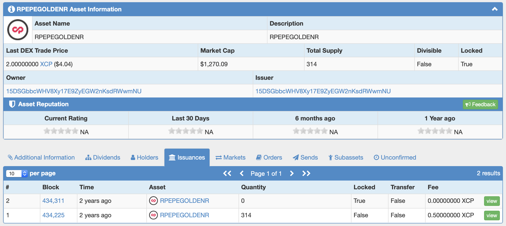

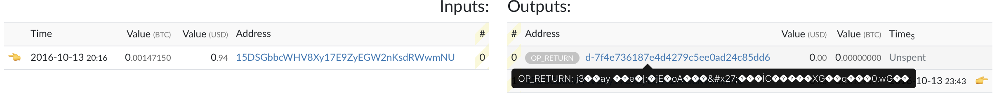

^ Bitcoin nodes don't know what Rare Pepe is, but they can forget the OP_RETURN transaction.

---

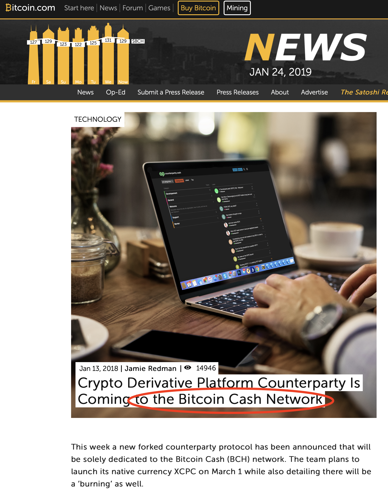

^ High fees, block size wars, people went to other chains

^ Fair question: what is the right size for OP_RETURN?

^ Answer: make it cheaper than the alternatives, but not too cheap

---


^ Winter is coming

<!-- https://www.forbes.com/sites/ktorpey/2019/01/09/a-new-blockchain-project-is-generating-20-of-daily-bitcoin-transactions/#57e947016129 -->


---

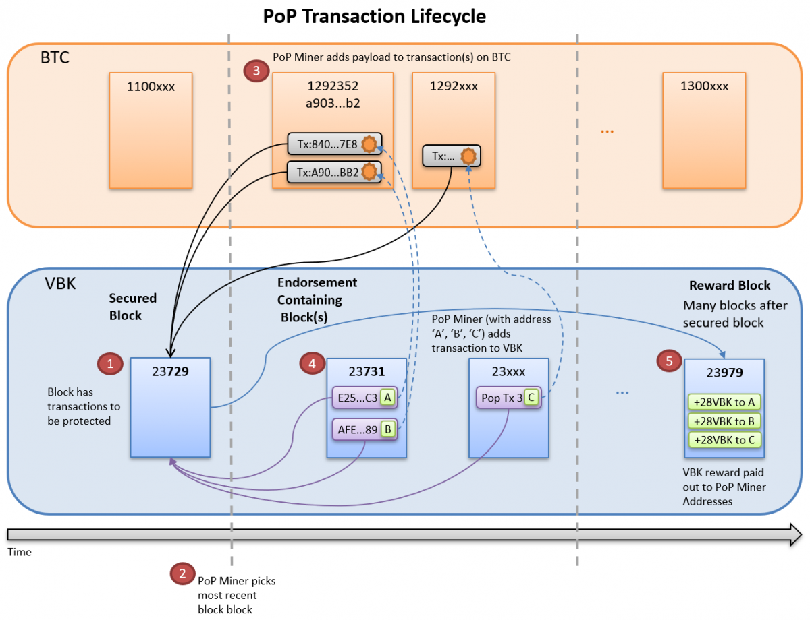

^ takeaway: spam the Bitcoin blockchain, earn tokens

^ Equilibrium fee level?

^ Garzik wrote OP_RETURN code

---

# Keep off the chain
## E.g. RGB protocol

1. Client side validation
2. Pay to Contract

^ Indistinguishable from normal transaction, so can't be censored.

---


---

# Ethereum Giveaway!


* RGB asset: 100 finney fully backed by me
* Bitcoin testnet private key: cP7453tMvkWPcEHfx8zpCQezoU5PeoQjjEYaCMzxD9Tz4f5GEpxW (access to 10 finney)
* Instructions: https://github.com/Sjors/presentations (after my talk)

---

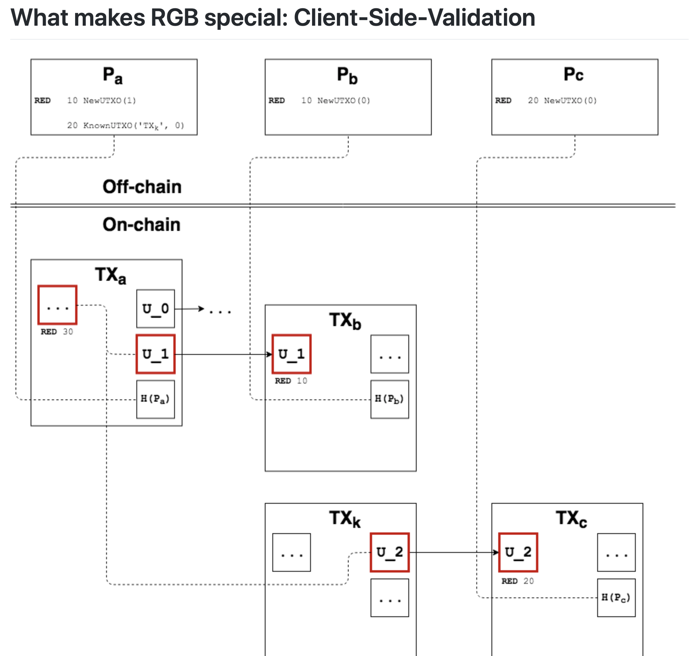

^ Confusing image, point is that on-chain txs are interpreted off-chain

---

# Client-side Validation

```bash
kaleidoscope issueasset --title "ETH (Finney)" --supply 1000
Asset ID: 6f840761c0b7d0af3514c4577af80899b65a1bf2c7d022a6c0c58afa2f8f2bc9
```

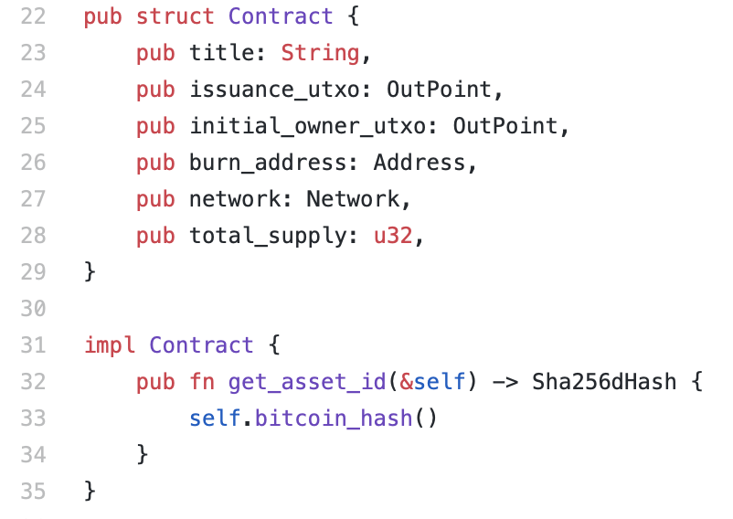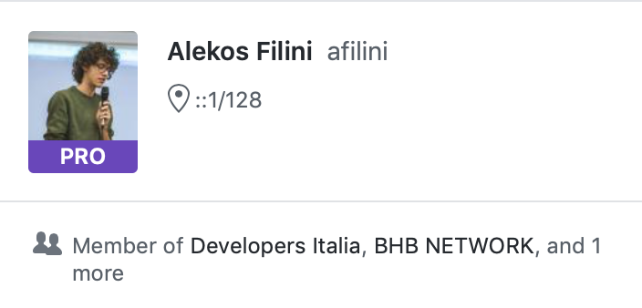

^ Current implementation by Alekos Filini (code sometimes more useful than spec)

^ Transaction on blockchain refers to asset id

^ asset id commits to rules, such as total supply and the initial owner

---

# Client-side Validation

```
Asset ID: 6f840761c0b7d0af3514c4577af80899b65a1bf2c7d022a6c0c58afa2f8f2bc9
sha256(6f840761c0b7d0af3514c4577af80899b65a1bf2c7d022a6c0c58afa2f8f2bc9)
c92b8f2ffa8ac5c0a622d0c7f21b5ab69908f87a57c41435afd0b7c06107846f
```

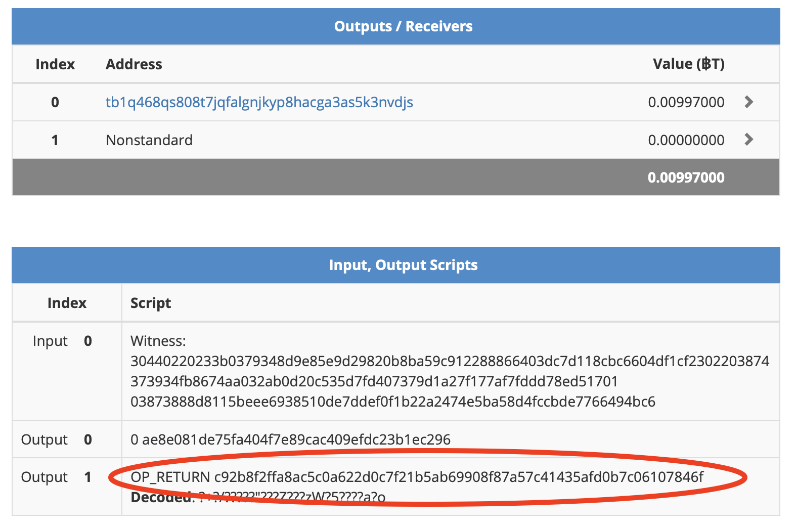

---

# Client-side Validation


```bash
kaleidoscope sendtoaddress tb1qj7mtznsd6uzmztma6yutkklv4ypjj4g9mhmmf4 \
             6f840761c0b7d0af3514c4577af80899b65a1bf2c7d022a6c0c58afa2f8f2bc9 \
             100
```

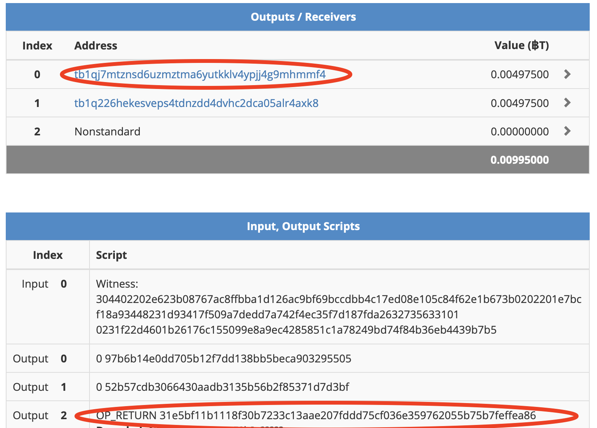

---

# Client-side Validation

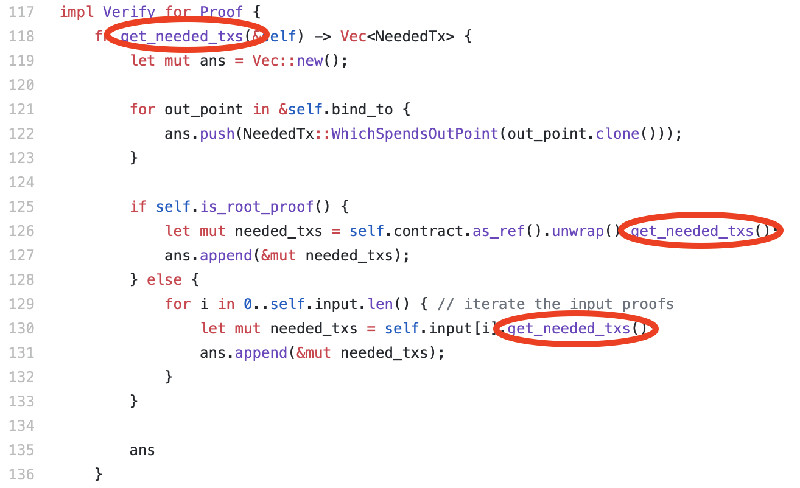

^ Commits to chain of proofs

^ Proofs are uploaded to a server, identified by outpoint (UTXO + index) (or put in a zip file, like in my demo)

---

# Pay to Contract

* OP_RETURN is suboptimal
* Tweak receive address to include hash
* good explainer [^4]

[^4]: https://blog.eternitywall.com/2018/04/13/sign-to-contract/

^ Similar mechanism used by Taproot to add secret spending conditions

^ In order to spend you must know the hash, so no accidental spending like with color coins

^ Recipient won't even see funds without this hash

---

# Pay to Contract


^ Part of RGB spec, but not implemented yet

---

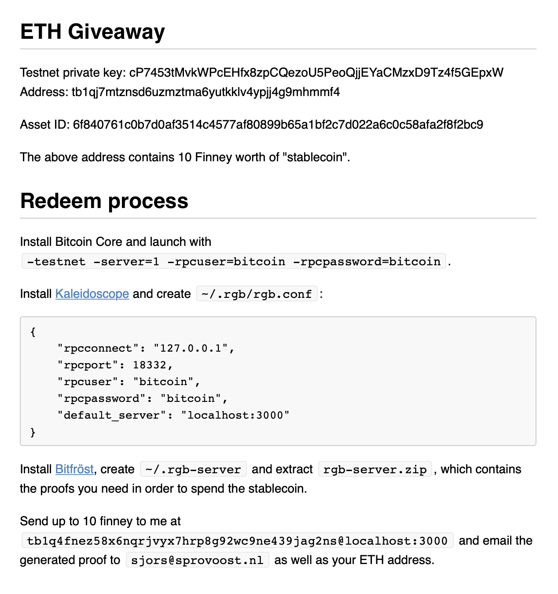

---

# Scaling - Proofmarshal

* Multiple transactions in one UTXO using a Merkle tree

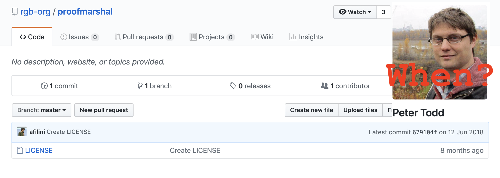

^ Don't yet understand how this works, figure out during Q&A?

^ Gist afaik: instead of single UTXO for each move, use Merkle tree to compress multiple proofs into one UTXO

---

# Scaling - Lightning (colored channels)

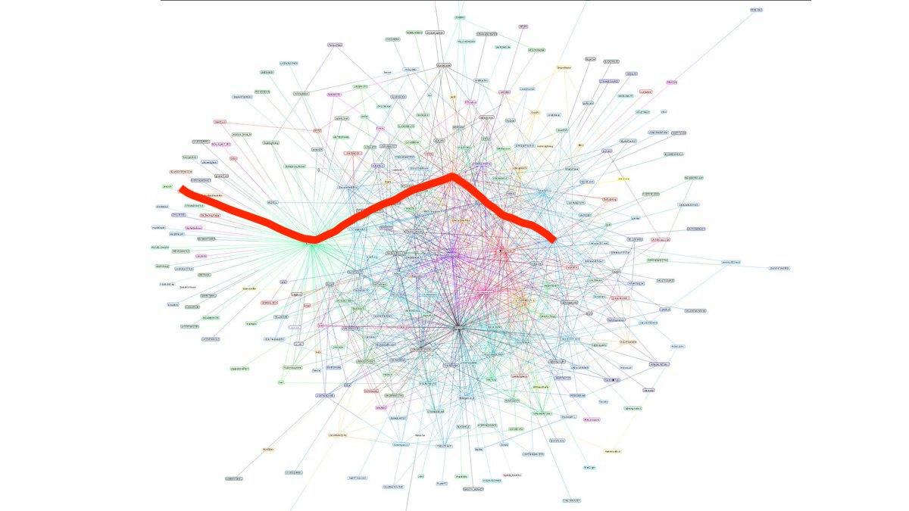

^ Colored channels

---

### Homework

- Study RGB: https://github.com/rgb-org/spec
- Help improve it before the hackathon (implementing pay-to-contract)
- Don't like it? Make something else.
- ETH Giveaway instructions: https://github.com/Sjors/presentations

```
PGP: ED9B DF7A D6A5 5E23 2E84  5242 57FF 9BDB CC30 1009
```
