footer: 2019-02-08 - Advancing Bitcoin - sjors@sprovoost.nl - @provoost on Twitter
slidenumbers: true
autoscale: false

#

# Bitcoin Core wallet

1. Graphic User Interface (bitcoin-qt)
2. Commandline Interface (bitcoin-cli)

---

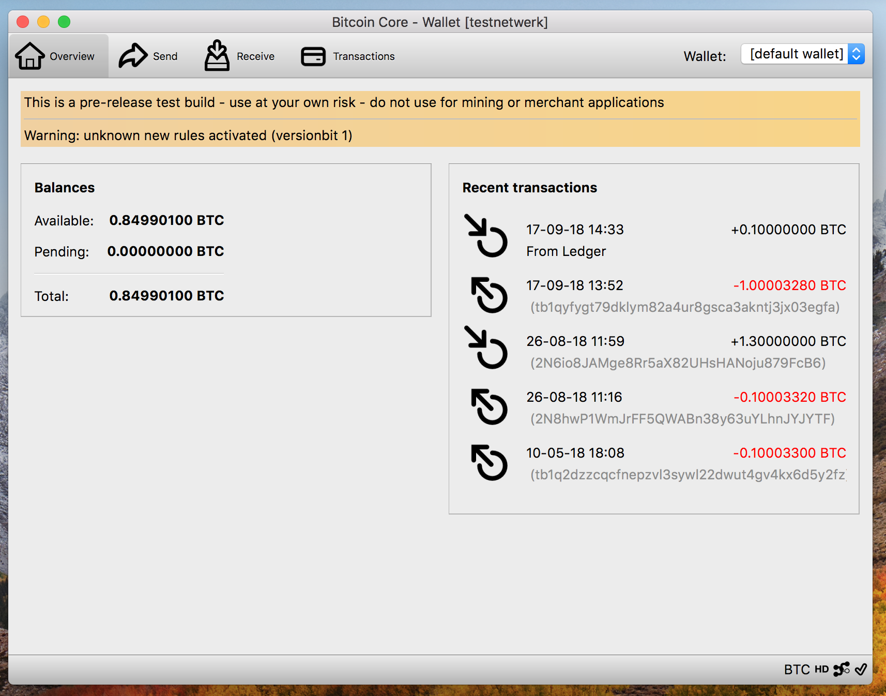

[.hide-footer]

---

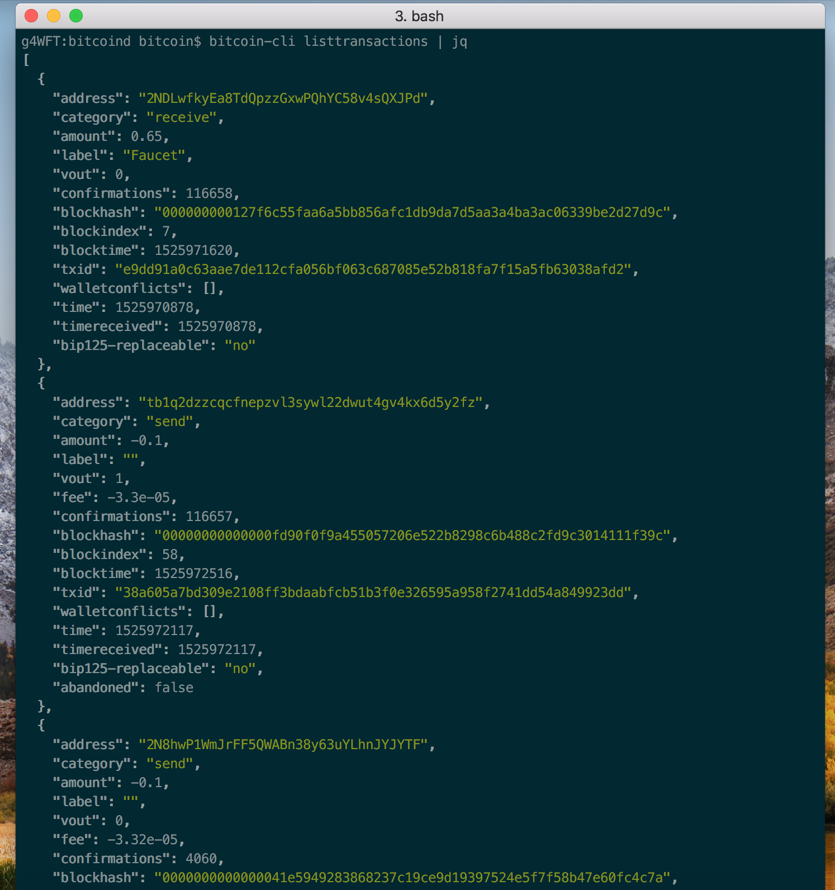

[.hide-footer]

---

# Bitcoin Core wallet

* validates all blocks
* well reviewed code
* sits on your computer

---

# Hardware Wallet

* not on your computer
* reveals addresses to 3rd party
* relies on external truth (e.g. SegWit2x)
* lots of (wallet) code

---

# Combined

* keys not on your computer
* great privacy
* no external truth
* only hardware specific code to review

---

# Ideally

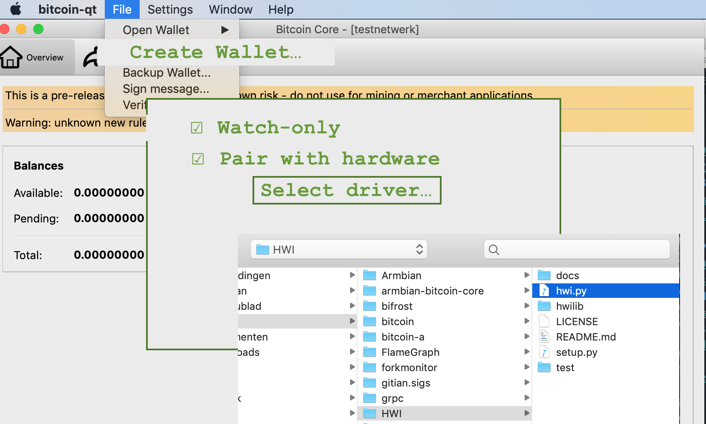

^ Ideally not even a driver, but baby steps...

---

# Ideally

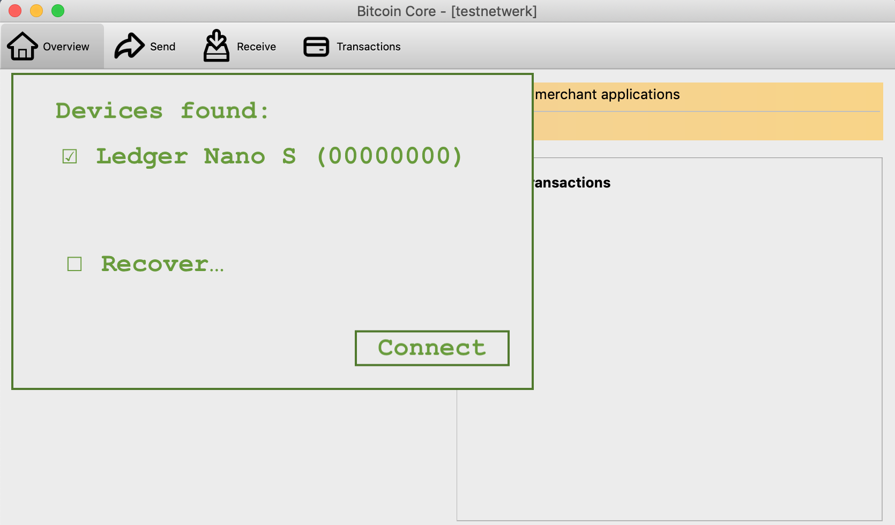

---

# Ideally

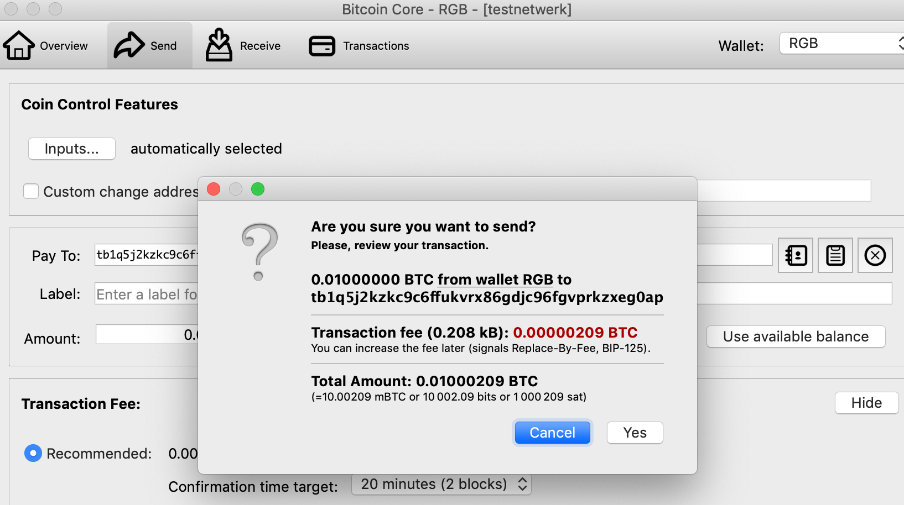

^ Receiving as usual, sending requires device

---

# Ideally

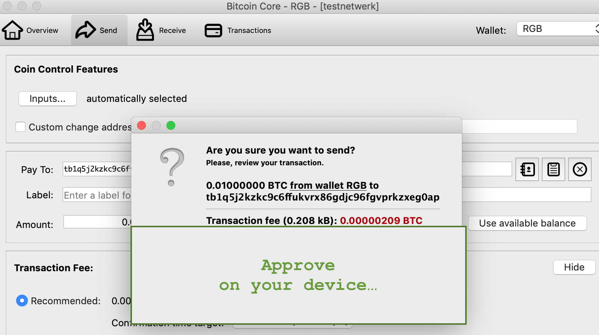

---

# In reality

1. Electrum Personal Server (works now! v0.16+)
2. Python scripts: HWI[^6] (v0.18?)
3. HWI + Bitcoin Core RPC (v0.19?)
4. GUI (v0.20+)

[^6]: Hardware Wallet Integration: https://github.com/bitcoin-core/HWI

---

# Electrum Personal Server[^5]

* install Bitcoin Core
* install Electrum
* install Electrum Personal Server
* small config change... profit!

[^5]: https://github.com/chris-belcher/electrum-personal-server

^ Uses Electrum UI, Core runs in background

^ Works today so check it out, but not focus of my presentation

---

# Problems

* how to encode transaction data? PSBT
* how to communicate between device and Core wallet?
  * (unix) pipes
  * JSON RPC
* minimize amount of stuff to install
* not too radical changes to Bitcoin Core

---

# Core + HWW Setup

* Start with empty watch-only wallet
* Import public keys from device

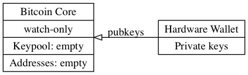

---

# Core + HWW Usage

* Generate unsigned transaction in Core
* Sign on device

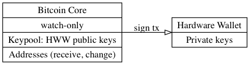

---

# HWI

* Bitcoin Hardware Wallet Interaction scripts[^0] by Andrew Chow

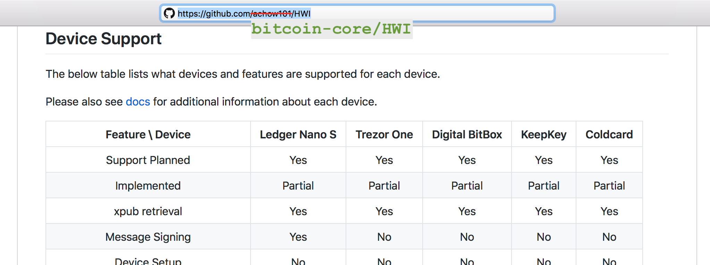

[^0]: https://github.com/bitcoin-core/HWI

---

# List devices

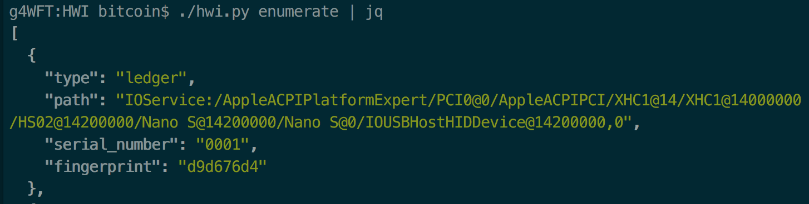

* Fingerprint (of master xpub): used as identifier

---

# Create watch-only wallet

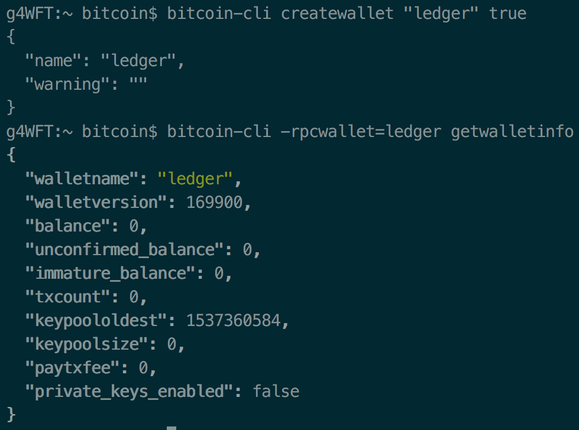

Usefull stuff added in v0.17.0:

* dynamic wallet create / load / unload
* watch-only wallets

---

# Get keys from device

* BIP32, e.g. native segwit: m/84'/1'/'0/{0,1}/\*'

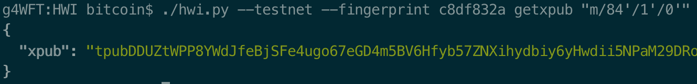

* "wpkh([c8df832a/84'/1'/0']tpubDDUZ...zka/0/\*)"

^ Need xpub as last hardened level, put it in descriptor

---

# Output Descriptors[^7]

* `wpkh([c8df832a/84'/1'/0']tpubDDUZ...zka/0/*)`
* or `pkh(../44'/...)` for legacy addresses
* or `multi(2,
            [0000001/84'/1'/0']tpubDDUZ...zka/0/\*,
            [0000002/84'/1'/0']tpubEEXZ...fab/0/\*)`

^ Explain descriptors, not a BIP (yet)

[^7]: https://github.com/bitcoin/bitcoin/blob/master/doc/descriptors.md

---

# Import keys into wallet

* `importmulti` RPC  (v0.18?)
  * descriptor support (MeshCollider[^2])
  * add imported keys to keypool (achow101[^8])

[^2]: https://github.com/bitcoin/bitcoin/pull/14491

[^8]: https://github.com/bitcoin/bitcoin/pull/14075

---

# Generate receive address

* no hardware device needed!

---

# Wait for confirmation

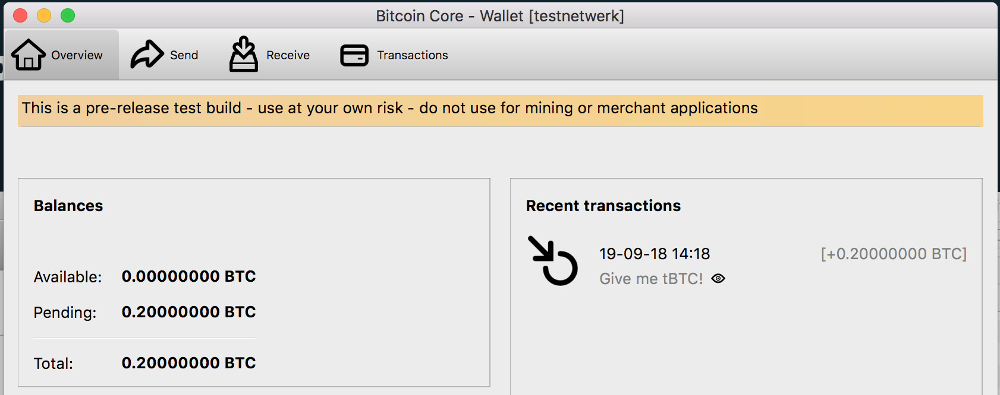

---

# Prepare transaction
## The hard way

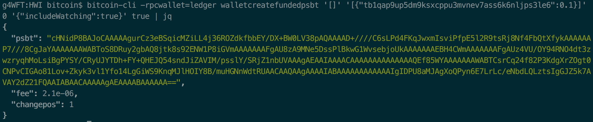

* note: `{includeWatching: true}`
* note: `true` at the end adds HD paths

---

# PSBT

* Partially Signed Bitcoin Transaction
* Added to v0.17.0

---

# Sign transaction

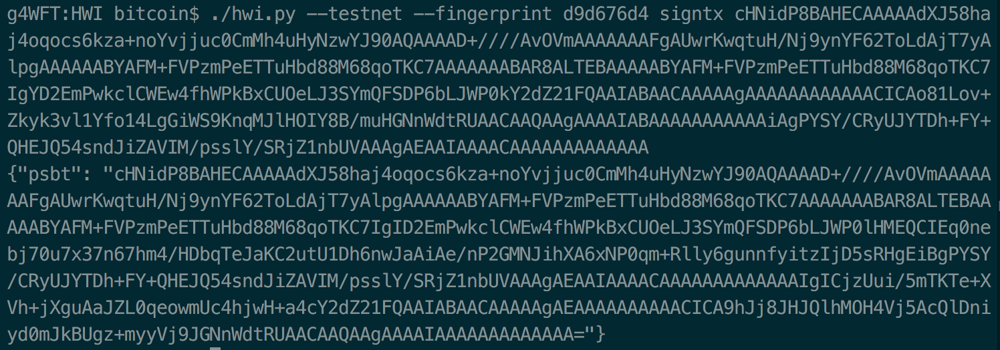

---

# Before

---

# After

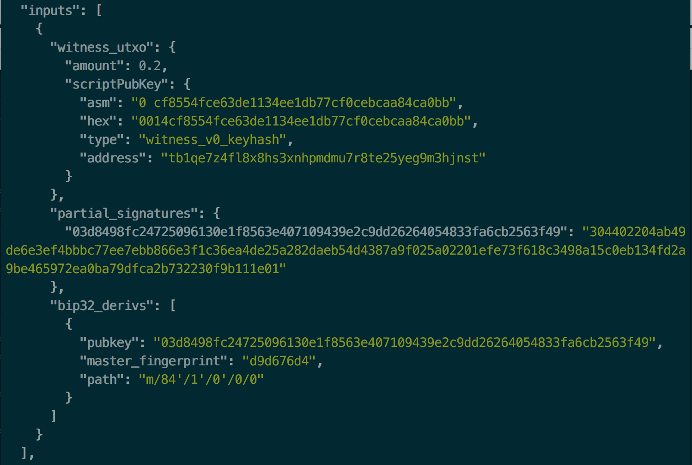

---

# Finalize and broadcast

---

# The easy way[^9]

* `bitcoind -signer=../HWI/hwi.py`
  * `enumeratesigners`
  * `signerfetchkeys`
  * `signerdisplayaddress`
  * `signerprocesspsbt`
  * `signersend`

[^9]: https://github.com/bitcoin/bitcoin/pull/14912

^ new RPC methods which call HWI

---

# The easy way
## `signersend`

* `signersend [{}] [{"DESTINATION": AMOUNT}]`
   optionally specify input coins, fee, etc
* approve on device
* profit

---

# Signer protocol

* hardware wallets can sign stuff
* multisig services like BitGo can sign stuff
* standard interface to communicate with signers?
  * (Python) commands; or
  * JSON RPC
* WIP proposal[^10] in PR 14912

[^10]: https://github.com/Sjors/bitcoin/blob/2018/11/rpc-signer/doc/external-signer.md

---

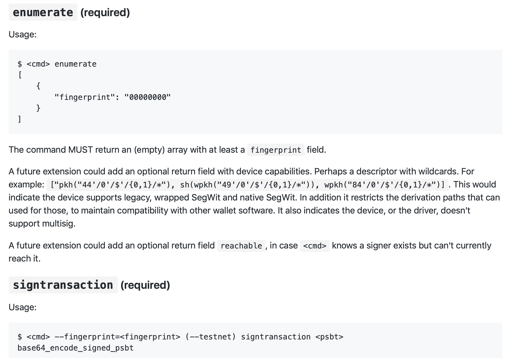

[.hide-footer]

---

# Thanks
Slides: [github.com/sjors/presentations](https://github.com/sjors/presentations)

Blog: [medium.com/provoost-on-crypto](https://medium.com/provoost-on-crypto)

PGP:
`ED9B DF7A D6A5 5E23 2E84  5242 57FF 9BDB CC30 1009`
